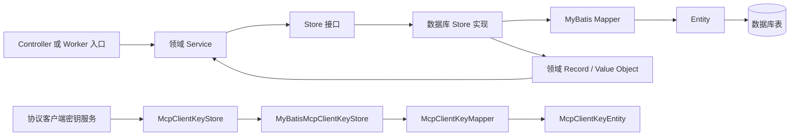
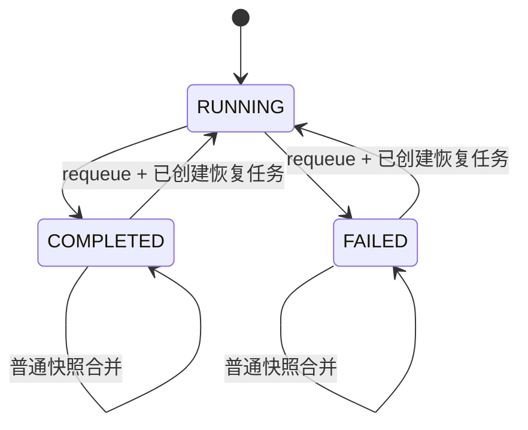

> Agent、协议、学习和工作流模块采用 Entity、Mapper、Store 分层承载数据库持久化。

# 数据库 Mapper 与领域持久化模式

Agent、协议、学习和工作流模块采用 `Entity`、`Mapper`、`Store` 分层承载数据库持久化。领域服务面向 `Store` 接口读写领域记录，数据库实现负责在领域模型与 MyBatis-Plus Entity 之间转换，Mapper 则封装表级查询、插入和条件更新。

这种分层将数据库结构与业务流程隔离开来：

- `Entity` 对应数据库表行，承载列映射和持久化字段。
- `Mapper` 继承 MyBatis-Plus `BaseMapper`，提供基础 CRUD，并补充需要原子性或特定条件的 SQL 操作。
- `Store` 定义领域侧的持久化能力，负责鉴权过滤、状态合并、JSON 编解码、时间类型转换和并发控制。
- 领域服务通过 `Store` 推动业务状态变化，不直接依赖数据库 Entity。

## 总体调用链



关键节点如下：

- Controller 或 Worker 入口负责接收请求、执行任务或恢复任务。
- Service 负责业务编排，例如工作流状态推进、学习评分和协议访问控制。
- `Store` 是领域与持久化实现之间的边界。同一接口可以存在 MyBatis 实现和内存实现。
- MyBatis Store 将领域记录转换为 Entity，再交给 Mapper 操作数据库。
- Entity 只表达数据库行结构，不承载工作流合并、访问授权或学习评分等业务决策。

## Agent 与工作流持久化

Agent 模块的持久化对象覆盖运行追踪、Worker 节点、Worker 任务、Outbox 事件和多智能体写作工作流：

- `AgentRunTraceEntity` 与 `AgentRunTraceMapper` 对应 Agent 运行追踪记录。
- `AgentWorkerNodeEntity` 与 `AgentWorkerNodeMapper` 对应 Worker 节点状态。
- `AgentWorkerTaskEntity` 与 `AgentWorkerTaskMapper` 对应 Worker 任务。
- `AgentWorkerTaskOutboxEventEntity` 与 `AgentWorkerTaskOutboxEventMapper` 支撑任务持久化后的事件发布。
- `MultiAgentWritingWorkflowEntity` 与 `MultiAgentWritingWorkflowMapper` 保存手册生成工作流快照。
- `HandoutRunMetricsMapper` 为手册运行指标提供数据库访问入口。

工作流 Entity 的核心字段包括：

- `workflowId`：所有写作阶段共享的不透明工作流 ID，同时作为主键。
- `tenantId`：隔离学校或部署租户。
- `subjectType`、`subjectId`：记录拥有该工作流的后端主体。
- `status`：工作流状态，例如 `RUNNING`、`COMPLETED`、`FAILED`。
- `message`：安全的状态消息，不保存原始提示词或模型输出。
- `metadataJson`：保存安全的阶段结果和提供方 token 使用量。
- `revision`：用于并发更新的单调递增版本。
- `createdAt`、`updatedAt`：记录生命周期时间。

`MultiAgentWritingWorkflowStore` 对外提供三类能力：

- `save`：保存或合并普通工作流快照。
- `findVisible`：根据工作流 ID 和认证主体读取可见快照。
- `findByIdInternal`：仅供已完成共享 Worker 密钥认证的内部 Worker 查询。
- `requeue`：持久化显式恢复转换，允许已完成工作流重新进入运行状态。

### 工作流快照的并发合并

数据库实现 `MyBatisMultiAgentWritingWorkflowStore` 不直接覆盖现有行，而是使用乐观并发控制：

1. 先按 `workflowId` 查询当前 Entity。
2. 如果记录不存在，尝试插入初始快照，初始 `revision` 为 `0`。
3. 如果插入期间其他 Worker 已插入同一工作流，捕获重复键异常并重新读取。
4. 如果记录已存在，将现有阶段结果与新快照做单调合并。
5. 使用 `updateIfRevisionMatches(entity, expectedRevision)` 按版本条件更新。
6. 更新失败时重新加载最新记录并重试，最多重试五次。
7. 多次重试仍未收敛时抛出并发更新异常。



普通 `save` 不允许旧快照回退已经完成的状态，避免并行 Writer 任务以较旧结果覆盖兄弟任务的阶段结果。`requeue` 是有明确前置条件的例外：恢复端点已经为同一工作流创建持久化任务，因此可以将完成状态重新置为 `RUNNING`。

### 可见性与内部读取边界

工作流读取区分浏览器请求和内部 Worker 请求：

- `findVisible` 要求工作流 ID 非空，且认证主体 ID 非空；读取后还要通过 `canView` 判断主体是否有权查看。
- `findByIdInternal` 只按工作流 ID读取，不执行浏览器侧可见性判断，但调用方必须已经完成共享 Worker 密钥认证。
- 因此，内部 Worker 查询不能作为普通浏览器查询接口暴露。
- `tenantId`、主体类型和主体 ID是工作流归属与访问过滤的重要持久化信息。

## Agent Trace 与 Worker 任务边界

Agent 运行追踪通过 `AgentTraceStore` 抽象持久化，数据库实现为 `MyBatisAgentTraceStore`。追踪记录对应 `AgentTraceRecord`，查询侧由 `AgentTraceQueryService` 根据 `AgentTraceSearchCriteria`提供诊断和用量摘要。

Worker 任务相关 Store 分布在任务生命周期的不同边界：

- `AgentWorkerTaskStore` 管理任务状态、租约、重试和失败标记。
- `AgentWorkerTaskOutboxStore` 管理待发布的 Outbox 事件。
- `MyBatisAgentWorkerTaskOutboxStore` 提供 Outbox 的数据库实现。
- `AgentWorkerLeaseRecovery` 负责处理租约恢复。
- `AgentWorkerTaskOutboxPublisher` 和 `AgentWorkerTaskOutboxScheduler` 负责从持久化事件继续发布消息。

这里的持久化职责是分开的：任务表记录“应该执行什么以及执行到哪里”，Outbox 表记录“哪些持久化事件还需要发布”。消息发布失败时，Outbox 记录可以继续被调度，而不要求重新创建业务任务。

## 协议客户端密钥持久化

协议模块当前明确的数据库持久化对象是 MCP 客户端密钥：

- `McpClientKeyEntity` 表示客户端密钥数据库行。
- `McpClientKeyMapper` 提供 MyBatis 数据库访问。
- `McpClientKeyStore` 定义协议侧客户端密钥存取边界。
- `MyBatisMcpClientKeyStore` 提供数据库实现。
- `InMemoryMcpClientKeyStore` 提供内存实现。

`McpClientKeyService` 位于 Store 之上，负责密钥服务流程；`McpClientResolver` 和 `McpAccessPolicy` 负责客户端解析及访问策略。协议请求由 `McpJsonRpcService`、工具执行服务和发现服务继续处理。

该设计使协议认证数据可以根据部署方式切换存储实现：

- 数据库启用时使用 `MyBatisMcpClientKeyStore`。
- 数据库未启用或测试场景可以使用 `InMemoryMcpClientKeyStore`。
- 上层协议服务依赖 `McpClientKeyStore`，不需要感知具体数据库实现。

## 学习状态持久化

学习模块将学生学习闭环拆成两类数据：

1. `StudentLearningAttemptEntity`
   - 保存一次学习尝试。
   - 包含租户、学生、题目、题目文本、知识点 ID、是否正确、响应耗时和提交时间。
   - 学习尝试是不可变记录，数据库 Store 通过 `insert` 新增。

2. `StudentKnowledgeMasteryEntity`
   - 保存学生对某个知识点的当前掌握度投影。
   - 根据租户、学生和知识点定位已有记录。
   - 该记录可以被更新，用于反映学习尝试带来的最新掌握状态。

`StudentLearningLoopStore` 对外提供学习尝试和掌握度的读写能力。`MyBatisStudentLearningLoopStore` 通过两个 Mapper 分别操作两类 Entity，并完成以下转换：

- 领域对象的知识点 ID 集合序列化为 JSON。
- `Instant` 转换为 UTC `LocalDateTime` 后写入数据库。
- 查询尝试时按租户和学生过滤，并按提交时间倒序排列。
- 领域层再根据知识点 ID过滤相关尝试。
- 掌握度查询使用 `tenantId`、`studentId` 和 `knowledgePointId` 组成定位条件。

学习闭环调用链可以概括为：

```mermaid
sequenceDiagram
    participant API as 学习 Controller
    participant Loop as StudentLearningLoopService
    participant Policy as StudentLearningScoringPolicy
    participant Store as StudentLearningLoopStore
    participant DB as MyBatis Store / Mapper

    API->>Loop: 提交 StudentAttemptRequest
    Loop->>Policy: 根据尝试计算评分与掌握度变化
    Loop->>Store: 保存学习尝试
    Store->>DB: insert StudentLearningAttemptEntity
    Loop->>Store: 保存掌握度投影
    Store->>DB: 查询或更新 StudentKnowledgeMasteryEntity
    Store-->>Loop: 返回领域状态
    Loop-->>API: 学习反馈与下一步响应
```

`StudentLearningScoringPolicy` 是学习规则的扩展点。更换评分策略时，持久化层仍然可以保持“不可变尝试 + 可更新掌握度投影”的结构。

## 数据库启用条件与内存替代

数据库实现使用：

```java
@ConditionalOnProperty(
    prefix = "math-agent.database",
    name = "enabled",
    havingValue = "true"
)
```

因此，数据库 Store 并不是无条件注册。当前证据表明至少以下领域支持替代实现：

- 学习模块：`InMemoryStudentLearningLoopStore` 与 `MyBatisStudentLearningLoopStore`。
- 协议模块：`InMemoryMcpClientKeyStore` 与 `MyBatisMcpClientKeyStore`。
- 工作流模块：`MyBatisMultiAgentWritingWorkflowStore` 是数据库实现，接口提供默认的 `requeue` 行为；具体是否存在其他工作流实现需要以配置和 Bean 装配为准。
- Agent Trace：通过 `AgentTraceStore` 抽象隔离实现，当前已读文件中明确了 `MyBatisAgentTraceStore`。

这种条件化装配适合测试、单机开发和数据库暂不可用的运行模式，但也带来边界条件：内存实现通常不提供跨进程恢复能力，不能替代 Worker 任务、工作流和 Outbox 对 durable 状态的要求。

## 关键边界条件

### 并发写入

工作流更新必须使用 `revision` 条件更新。直接使用普通覆盖更新可能造成：

- 并行 Writer 的阶段结果互相覆盖。
- 已完成状态被旧的 `RUNNING` 快照回退。
- Worker 恢复任务已经入队，但数据库仍显示旧的完成状态。

数据库 Store 通过重新读取、合并和 CAS 重试处理这些情况；重试耗尽则明确失败，而不是返回不确定快照。

### 重复创建

工作流首次保存采用“查询后插入”时，多个 Worker 可能同时发现记录不存在。实现通过捕获重复键异常重新加载并合并，保证同一 `workflowId`不会因为竞争产生两个工作流行。

### 状态恢复

普通快照保存和显式 `requeue`语义不同：

- 普通保存不能让旧快照隐藏新阶段或回退终态。
- `requeue` 只能用于已经创建恢复任务的流程。
- 找不到待恢复的工作流时抛出“工作流不存在”错误。
- 恢复更新同样受 `revision` 乐观锁约束。

### 访问控制

工作流查询不能只依赖数据库主键。对外读取必须携带认证主体，并校验主体是否能查看该工作流；内部 Worker 查询则必须位于已认证的内部边界之后。

协议密钥的读取还受到客户端解析和 `McpAccessPolicy` 约束。Store 负责数据存取，访问策略仍属于协议服务层，不应下沉为通用 Mapper 逻辑。

### 数据格式

工作流阶段结果、提供方 token 使用量和学习知识点 ID都以 JSON 字段或 JSON 字符串形式持久化。扩展这些字段时需要同时维护：

- JSON 序列化和反序列化结构。
- 空值、格式错误和旧版本字段的兼容性。
- 数据库字段长度及敏感信息脱敏边界。
- 领域对象与 Entity 之间的双向转换。

## 主要扩展点

- 为新的数据库表增加对应 `Entity` 和 `Mapper`，保持 Entity 只表达行结构。
- 在领域模块增加 `Store` 接口，再提供 MyBatis 实现或内存实现。
- 将 JSON 字段封装在 Store 转换层，避免 Controller 和领域服务直接操作数据库字符串。
- 对需要并发安全的聚合增加版本字段和条件更新 Mapper 方法。
- 对事件可靠发布场景增加任务表与 Outbox Store，而不是在事务外直接发送消息。
- 为协议客户端注册增加新的 Store 实现时，保持 `McpClientKeyService` 不感知存储介质。
- 替换学习评分规则时实现新的 `StudentLearningScoringPolicy`，不改变尝试记录和掌握度投影的持久化契约。
- 扩展工作流阶段时更新 `WorkflowMetadata`、快照合并逻辑和 JSON 兼容处理，确保并行任务仍然以单调方式合并。

Sources: [MultiAgentWritingWorkflowEntity.java](backend-java/src/main/java/com/doob/mathagent/agent/entity/MultiAgentWritingWorkflowEntity.java#L1-L80), [MultiAgentWritingWorkflowMapper.java](backend-java/src/main/java/com/doob/mathagent/agent/mapper/MultiAgentWritingWorkflowMapper.java#L1-L80), [MyBatisMultiAgentWritingWorkflowStore.java](backend-java/src/main/java/com/doob/mathagent/agent/service/MyBatisMultiAgentWritingWorkflowStore.java#L1-L80), [MultiAgentWritingWorkflowStore.java](backend-java/src/main/java/com/doob/mathagent/agent/service/MultiAgentWritingWorkflowStore.java#L1-L80), [MyBatisStudentLearningLoopStore.java](backend-java/src/main/java/com/doob/mathagent/learning/MyBatisStudentLearningLoopStore.java#L1-L80)
