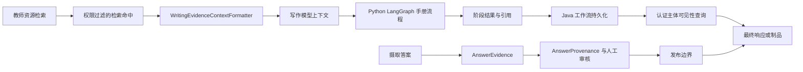

> TeachingEvidence、答案证据和来源模型连接检索、写作及最终响应，工作流查询通过认证主体限制可见范围。

# 证据溯源与可见性控制

本页聚焦证据从检索、写作上下文、答案发布到最终响应的边界控制。核心原则是：检索结果先经过权限过滤，再进入写作上下文；答案只有满足来源与审核条件，才能越过发布边界；工作流、制品和阶段结果则必须通过认证主体的租户与主体身份校验后才可读取。

## 模块职责

### `TeachingEvidence`

`TeachingEvidence` 是手册写作入口中的受控证据快照。当前源码中可确认它至少承载以下信息：

- `sourceDocumentId`：来源文档身份。
- `sourceScope`：来源范围。
- `canonicalQuestionNumber`：规范化题号。
- 由文档身份派生的 `documentRef` 用于在 Python 写作流程中引用来源，但 Python 不直接获得原始文档路径或凭证。

异步手册提交时，`MultiAgentWritingService` 从规范化请求中提取初始证据，并将其写入工作流阶段快照，同时把证据绑定到派发给 Python 的请求中。这样，工作流的证据状态与实际执行输入可以一起恢复。

### `AnswerEvidence` 与 `AnswerProvenance`

`AnswerEvidence` 位于摄取发布边界，组合答案内容、来源、人工审核状态和模型信息：

```java
record AnswerEvidence(
    String answer,
    AnswerProvenance provenance,
    boolean humanApproved,
    String model
)
```

`AnswerProvenance` 区分四类答案来源：

- `OFFICIAL`：正式来源答案。
- `HUMAN_APPROVED_MODEL_ASSISTED`：经过人工批准的模型辅助答案。
- `MODEL_ASSISTED`：模型辅助答案，但未必经过人工批准。
- `MANUAL`：人工答案。

该模型表达了一个明确的可见性规则：模型辅助本身不能自动使答案公开，只有经过审核的模型辅助答案，或符合正式来源规则的答案，才可以进入发布流程。`AnswerEvidence` 的注释将此规则定位在 publication boundary，即发布门，而不是普通检索或写作阶段。

### `WritingEvidenceContextFormatter`

`WritingEvidenceContextFormatter` 将已经完成权限过滤的教师资源检索命中转换为模型可读的证据上下文。它负责：

- 保留检索排序顺序。
- 对每个命中的证据文本进行长度限制。
- 输出人类可读的文档标题、文档 ID 和块 ID。
- 仅输出后端已授权的图片 URI。
- 排除带有 `pageNo` 的页面渲染资源。
- 只接受 MIME 类型为 `image/*` 的资源。
- 按 `maxAssets` 限制每个命中的图片数量。
- 不让原始路径、凭证或本地文件跨越写作边界。

页面渲染图被定义为检索证据，而不是可直接发布的教学图片。题目关联图需要在题目与来源关系已被确定后，由确定性渲染流程稍后附加。这一限制通过代码过滤实现，而不是依赖提示词要求模型自行遵守。

当命中为空、证据文本为空、最大文本长度非正数或最大资源数量为零时，相应内容会被省略。文本会先去除首尾空白，再按上限截断。

## 调用链



关键节点如下：

1. **检索命中**  
   写作格式化器接收的命中已经完成权限过滤。格式化器本身不负责扩大访问范围，只负责把已授权结果转换成模型上下文。

2. **写作上下文**  
   上下文中使用文档标题、文档 ID、块 ID 和有限长度的证据文本。图片只保留后端授权的非页面级图片 URI。

3. **Python 手册流程**  
   Java 控制面通过 `PythonHandoutClient` 调用 Python 拥有的 LangGraph 流程。Java 不规划或执行 Python 内部的模型阶段，而是负责工作流所有权、派发、恢复和结果投影。

4. **工作流持久化**  
   阶段结果会被保存为 `MultiAgentWritingWorkflowRecord` 的一部分。响应和制品都从持久化记录投影，而不是直接暴露 Python 原始返回对象。

5. **最终可见性查询**  
   工作流查询统一调用 `workflowStore.findVisible(workflowId, subject)`。因此，即使调用方知道工作流 ID，也必须通过认证主体的可见性检查。

6. **答案发布**  
   答案证据走另一条摄取发布边界。来源类型、人工审核状态和模型来源共同决定答案是否可以公开。

## 工作流生命周期与关键状态

`MultiAgentWritingService` 中可确认的主要状态包括：

- `RUNNING`：工作流已创建、排队、执行中，或正在等待 Worker 重试。
- `COMPLETED`：Python 返回完成结果，阶段结果已经保存。
- `FAILED`：Worker 重试耗尽后，服务显式将任务标记为失败。

同步入口 `run` 的顺序是：

1. 规范化请求。
2. 要求启用实时模型执行。
3. 规范化认证主体。
4. 要求主体为教师或管理员。
5. 检查 Python 手册运行时配置。
6. 创建并持久化 `RUNNING` 工作流。
7. 执行 Python 手册流程。
8. 将结果阶段、授权图片信息和状态投影回响应。

异步入口 `startAsync` 会先根据认证主体与 `clientRequestId` 计算或生成 `workflowId`，然后调用 `findVisible` 检查是否已经存在可见工作流。若存在，则直接返回已有响应，避免重复提交同一个写作运行。

Worker 执行入口 `executeDispatchedPython` 也先通过认证主体读取工作流。已完成的工作流直接返回；其他状态才会继续执行 Python 图，并传入恢复标记。Python checkpoint 因此成为重复投递时的恢复基础。

运行时异常不会立即把工作流标记为 `FAILED`。服务会保留已有阶段结果，将状态维持为 `RUNNING` 并记录“重试已安排”的消息，再把异常交给 Worker 重试机制处理。只有 `failDispatchedStage` 在重试耗尽后才会写入 `FAILED`。

## 可见性边界

### 认证主体

`RequestSubject` 是工作流所有权和读取权限的基础。工作流记录保存：

- `tenantId`
- `subjectType`
- `subjectId`

查询时，`MultiAgentWritingService` 将工作流 ID 和认证主体传递给 `workflowStore.findVisible`。因此，工作流可见性至少受租户和主体身份共同限制。

Worker 执行时没有直接信任消息中的调用者身份，而是通过 `resolveWorkerSubject` 从 Java 自己持有的工作流记录恢复主体：

```java
return new RequestSubject(
    workflow.tenantId(),
    workflow.subjectType(),
    workflow.subjectId(),
    "agent-worker"
).normalize();
```

这使 Worker 可以代表原始工作流主体执行，但主体来源仍是持久化记录，而不是不透明任务载荷中的任意字段。

### 阶段结果与制品

`artifact` 查询同样先执行主体可见性检查，再把工作流阶段转换为制品阶段。投影过程中会：

- 保留阶段代码、Agent、trace、提供方和模型信息。
- 只使用安全处理后的生成文本。
- 合并阶段引用。
- 保留资源放置记录。
- 跳过没有生成内容的阶段。
- 生成结构化章节和合并后的 Markdown。

因此，制品不是绕过工作流权限的独立读取路径；它仍然由同一条认证主体可见性边界保护。

### 图片与文档身份绑定

Python 只接收和返回不透明的 `documentRef`。Java 在导出或结果投影前，根据当前请求中已经授权的初始 `TeachingEvidence` 恢复真实文档身份：

1. 使用工作流 ID 与 `sourceDocumentId` 生成可预测但不透明的文档引用。
2. 建立 `documentRef -> TeachingEvidence` 映射。
3. 仅处理 `resource_curation` 阶段。
4. 读取阶段生成的 JSON。
5. 对 `items` 和 `inspectedItems` 中的图片引用进行匹配。
6. 匹配成功后补入 `sourceDocumentId`、`sourceScope` 及规范化题号等来源字段。
7. 无法识别的引用保持未绑定，不能物化为图片。

这个边界避免 Python 直接接触本地文档路径，同时防止模型返回未经授权的文档引用后被导出流程当作真实资源处理。

## 证据可见范围的阶段差异

证据在不同阶段具有不同的可见形式：

| 阶段 | 可见内容 | 明确禁止或限制 |
| --- | --- | --- |
| 检索结果 | 已授权的资源块、排序结果、证据文本、资源引用 | 不应绕过权限过滤 |
| 写作上下文 | 文档标题、文档 ID、块 ID、截断后的文本、有限图片 URI | 原始路径、凭证、本地文件、页面级图片 |
| Python 结果 | 不透明的文档引用、阶段内容、引用和资源放置 | 不直接恢复真实文档身份 |
| Java 投影 | 工作流状态、阶段快照、引用、绑定后的授权来源信息 | 未识别的引用不能生成图片 |
| 最终查询 | 认证主体可见工作流或制品 | 不属于当前租户或主体的工作流 |
| 答案发布 | 通过来源与审核规则的答案证据 | 未审核的模型辅助答案不得自动公开 |

## 主要文件

- `backend-java/src/main/java/com/doob/mathagent/teaching/TeachingEvidence.java`  
  写作请求中的受控教学证据模型，承载来源文档、范围及题目关联信息。

- `backend-java/src/main/java/com/doob/mathagent/ingestion/AnswerEvidence.java`  
  组合答案文本、答案来源、人工审核状态和模型信息。

- `backend-java/src/main/java/com/doob/mathagent/ingestion/AnswerProvenance.java`  
  定义正式、人工审核模型辅助、普通模型辅助和人工答案四种来源类型。

- `backend-java/src/main/java/com/doob/mathagent/agent/service/WritingEvidenceContextFormatter.java`  
  将已授权检索命中格式化为有界、可审计的写作证据上下文，并过滤页面级图片。

- `backend-java/src/main/java/com/doob/mathagent/agent/service/MultiAgentWritingService.java`  
  负责证据初始化、工作流所有权、认证主体校验、Python 调用、结果保存、图片来源绑定、响应和制品投影。

- `backend-java/src/main/java/com/doob/mathagent/agent/service/MultiAgentWritingWorkflowStore.java`  
  提供工作流存取边界，其中 `findVisible` 用于按认证主体限制查询结果。

- `backend-java/src/main/java/com/doob/mathagent/agent/service/MyBatisMultiAgentWritingWorkflowStore.java`  
  工作流持久化实现，保存工作流身份、主体信息、状态和阶段结果，为异步恢复及可见性查询提供数据基础。

## 边界条件与风险点

- 检索命中为空时，写作证据上下文为空，不会人为生成来源内容。
- 证据文本为空时，该命中不会进入模型上下文，即使它带有资源引用也不会单独产生输出。
- 文本和图片资源都有明确上限，避免单个检索命中无限扩大模型上下文。
- 页面级图片不会进入写作提示词，避免模型复制整页来源内容。
- Python 返回未知 `documentRef` 时，Java 不会补全真实文档身份，也不会让该引用物化为可导出图片。
- 仅知道 `workflowId` 不足以读取工作流，仍必须通过 `findVisible`。
- 已完成工作流的重复异步提交会返回已有结果，而不是再次排队。
- 执行异常期间保持 `RUNNING`，避免在 Worker 尚未耗尽重试时暴露错误的终态。
- 只有 Worker 重试耗尽后的失败处理才会写入 `FAILED`。
- `AnswerProvenance.MODEL_ASSISTED` 与人工审核是分离状态，不能把“由模型生成”直接等同于“可公开”。

## 扩展点

1. **增加证据字段**  
   可在 `TeachingEvidence` 中扩展页码、章节、引用置信度或审核状态，但需要同步更新请求规范化、工作流快照、`documentRef` 绑定和制品投影。

2. **替换写作上下文格式**  
   `WritingEvidenceContextFormatter` 是包内独立格式化边界，可增加引用编号、来源时间或证据类型，同时继续保持权限过滤、长度限制和资源过滤职责不外泄。

3. **扩展答案发布策略**  
   `AnswerProvenance` 可以增加新的来源分类；对应的发布门应继续基于结构化来源和审核状态判断，而不是依赖答案文本或模型名称推断。

4. **增强主体可见性策略**  
   `findVisible` 可以在租户、主体类型和主体 ID 之外增加角色、资源授权或共享范围，但所有工作流和制品读取入口都应继续复用同一可见性存储接口。

5. **增加证据审计信息**  
   可在阶段快照和制品引用中保留检索请求、证据版本或授权决策 ID，以支持结果追溯，但不应把原始凭证和本地路径暴露给 Python 或最终响应。

Sources: [AnswerEvidence.java](backend-java/src/main/java/com/doob/mathagent/ingestion/AnswerEvidence.java#L1-L5)、[AnswerProvenance.java](backend-java/src/main/java/com/doob/mathagent/ingestion/AnswerProvenance.java#L1-L5)、[WritingEvidenceContextFormatter.java](backend-java/src/main/java/com/doob/mathagent/agent/service/WritingEvidenceContextFormatter.java#L1-L71)、[MultiAgentWritingService.java](backend-java/src/main/java/com/doob/mathagent/agent/service/MultiAgentWritingService.java#L54-L185)、[MultiAgentWritingService.java](backend-java/src/main/java/com/doob/mathagent/agent/service/MultiAgentWritingService.java#L187-L225)、[MultiAgentWritingService.java](backend-java/src/main/java/com/doob/mathagent/agent/service/MultiAgentWritingService.java#L227-L299)
