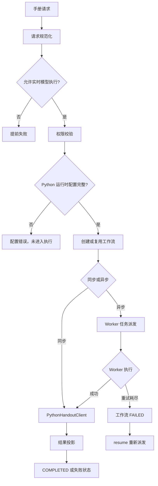

> 模型不可用、预算超限、Worker 重试耗尽、检索缓存禁用及 Python 运行时配置缺失都会改变主链路结果，需要重点排查错误投影和恢复行为。

# 失败、降级与外部依赖风险

模型、Python 运行时、Worker 消息链路和检索缓存都位于主链路边界上。它们的失败不会只影响单个内部方法，还可能改变工作流状态、响应内容、证据新鲜度以及后续恢复方式。当前代码的核心原则是：Java 控制面负责校验、持久化、派发和结果投影；模型调用、提供方回退、输出修复和用量记账交给 Python Worker 执行。

## 主链路中的失败边界

手册生成同步入口 `MultiAgentWritingService.run` 按以下顺序执行：

1. 规范化请求。
2. 检查是否允许实时模型执行。
3. 规范化认证主体并校验教师或管理员权限。
4. 检查 Python 手册运行时配置。
5. 创建并持久化 `RUNNING` 工作流。
6. 调用 Python 手册客户端执行完整图。
7. 将 Python 结果投影为 Java 工作流响应和制品。

异步入口 `startAsync` 也会在持久化和派发前完成模型、权限及 Python 运行时检查，然后创建或复用工作流，并通过 `AgentWorkerTaskDispatchService` 发布一个不透明的 Python 手册任务。带有 `clientRequestId` 时，工作流 ID 按认证主体和请求 ID 确定性生成；重复提交会读取已有工作流，不再重复入队。

图中的“提前失败”与“配置错误”发生在工作流持久化之前；Worker 重试耗尽则发生在工作流已经存在之后，因此两者的恢复语义不同。前者通常不会留下本次工作流记录，后者必须依赖已有工作流状态进行查询和恢复。

## 模型不可用与预算超限

### 模型不可用

`AiProviderUnavailableException` 表示配置的模型端点在有限次数重试后仍无法接受请求。异常只保留 HTTP 状态码和安全消息，提供方响应体不会直接返回浏览器，因为响应体可能包含运行请求标识；网关应将其受限形式写入服务端日志。

这形成了一个明确的信息投影边界：

- 客户端可以获得有限的状态信息。
- 提供方原始响应体不应进入公共响应。
- 运维诊断依赖服务端日志中的受限信息。
- “重试后仍不可用”与单次请求失败应保持可区分，否则前端和调用方无法判断是否适合重试。

当前证据只说明异常契约和 Python 执行边界，没有显示控制器或全局异常处理器如何把该异常转换成 HTTP 响应。因此，错误投影的重点检查位置是 Agent 执行控制器及统一异常处理链：需要确认 HTTP 状态码、错误消息和 trace/请求标识没有泄漏提供方响应体。

### 预算超限

`AgentBudgetExceededException` 在提供方调用之前抛出，表示签名执行计划超出 token 预算或配置的成本预算。它与模型不可用不同：

- 预算超限是本地策略拒绝，不应触发提供方调用。
- 重试不能解决预算不足。
- 客户端应收到稳定、可理解的预算拒绝，而不是被误报为模型不可用。
- Agent 执行链路需要避免在预算拒绝后创建“已调用模型”的 usage 或 provider trace。

Java 的 `AgentRunExecutionService` 保留身份、策略、预算、并发租约和 trace；模型调用、提供方回退、输出修复及 usage 记账交给 `AgentRunClient` 和 Python Worker。这意味着预算检查和实际 provider 执行之间存在跨运行时边界，排查时需要核对签名计划中的预算与 Python 侧最终用量记账是否一致。

## Python 运行时配置缺失

手册同步、异步提交、Worker 执行以及恢复入口都调用 `requireConfiguredHandoutRuntime`：

- `run` 在创建工作流前检查。
- `startAsync` 在生成或复用工作流前检查。
- `executeDispatchedPython` 在读取工作流并执行前检查。
- `resume` 在读取失败工作流并重新派发前检查。

因此，Python 运行时配置缺失会阻断主链路，而不是被当作一次普通的 Python 阶段失败。尤其在异步入口中，配置检查位于 `dispatchService.submit` 之前，配置错误不会产生待消费的 Worker 命令。

执行方法还保留了 `pythonHandoutClient == null` 的防御性检查，并抛出“Java AI execution is disabled for handout tasks”的非法状态异常。这是另一种配置或装配故障，表示 Java 控制面没有可用的 Python 客户端。它与 Python 服务返回的业务失败应区分处理，否则会把部署配置错误伪装成模型或内容生成错误。

恢复入口同样要求运行时配置完整。也就是说，配置修复是恢复失败工作流的前置条件；不能只重新派发一个已经知道无法执行的任务。

## Worker 重试耗尽与工作流状态

Worker 任务重试耗尽后，`failDispatchedStage` 读取并验证当前调用者对工作流的可见性，然后将工作流保存为 `FAILED`。错误摘要具有边界保护：

- 没有摘要时使用固定消息。
- 有摘要时最多保留前 300 个字符。
- Java 不解释失败内容，也不把 Worker 失败转换成某个 Java 阶段失败。
- 已有阶段快照会被保留，便于诊断和恢复。

这意味着 `FAILED` 是控制面记录的可恢复状态，而不是必然代表所有阶段结果都丢失。恢复时：

- `RUNNING` 工作流拒绝再次恢复，避免并发或重复运行。
- 非 `RUNNING` 工作流会使用同一工作流 ID重新派发一个 Python 图。
- 已完成工作流通常直接返回现有结果。
- 如果已完成工作流带有新的初始证据，恢复逻辑会刷新授权证据快照并重新排队。
- 恢复不会依赖 Java 对 Python 阶段的细粒度假设，而是重新交给 Python 图和其 checkpoint 机制处理。

重复投递的恢复基础由两部分组成：Java 工作流记录保存归属、状态、阶段快照和结果；Python 运行时负责利用 checkpoint 避免重复执行已经可恢复的图节点。排查时应重点确认以下状态是否一致：

- Worker 任务是否已经重试耗尽，但工作流仍停留在 `RUNNING`。
- `FAILED` 工作流是否仍能通过主体和租户可见性查询。
- 恢复派发是否创建了重复任务。
- 阶段快照是否与 Python checkpoint 对应。
- `failDispatchedStage` 的错误摘要是否足以定位问题，同时没有暴露内部响应体。

## 检索缓存禁用

`DisabledTextbookSearchCache` 在 `math-agent.redis.search-cache.enabled=false` 时作为 `TextbookSearchCache` 的实现被装配。检索服务仍然依赖统一的缓存接口，但禁用实现具有明确的直通语义：

- `find` 永远返回空，所有查询都会继续读取当前 MySQL/Milvus 状态。
- `put` 丢弃结果，不保留任何缓存状态。
- 禁用缓存的主要用途是源数据重新同步和绕过旧 OCR 结果的验收运行。

因此，缓存禁用不是“缓存不可用时继续使用旧值”的降级，而是强制绕过缓存。它会改变主链路的两个性质：

1. 结果时效性提高，查询能观察到重新同步后的当前数据。
2. 查询延迟和外部检索后端压力可能增加。

缓存命中与否还会影响检索审计、命中记录和响应时序。排查检索结果差异时，应区分以下情况：

- 缓存命中返回旧的检索快照。
- 缓存被显式禁用，结果来自当前 MySQL/Milvus。
- 缓存未命中后重新查询并写入缓存。
- 外部检索后端本身失败。

当前证据只支持“禁用缓存时强制直读”的行为，不足以推断 Milvus、MySQL 或 Redis 连接失败时的统一降级策略。这部分应继续核查 `TextbookRetrievalService`、缓存配置和检索控制器的异常投影。

## 错误投影与恢复检查清单

### 入口前失败

模型实时执行不允许、权限不足或 Python 运行时配置缺失，都会在手册工作流创建或派发前阻断。检查点是：

- 是否返回稳定的客户端错误，而不是通用服务器错误。
- 是否错误地创建了空的 `RUNNING` 工作流。
- 是否把配置缺失投影成模型不可用。
- 是否在异步幂等请求中因为失败而留下半完成的幂等记录。

### 执行中失败

模型端点不可用、预算超限和 Python Worker 执行失败属于不同类别：

- 模型不可用：有限重试后失败，保留 HTTP 状态码，隐藏响应体。
- 预算超限：调用提供方之前拒绝，不应重试 provider。
- Worker 失败：由任务重试和租约边界处理，耗尽后将工作流标记为 `FAILED`。

这些错误不能只依赖一条通用消息，否则会丢失恢复动作所需的语义。

### 恢复后失败

`resume` 会再次进行模型执行检查、权限检查和 Python 运行时配置检查。因此恢复操作本身可能在重新派发前失败。恢复成功后，工作流状态先回到 `RUNNING`，随后由 Worker 再次执行 Python 图。需要防止恢复请求与仍在运行的原任务并发，代码目前对已知 `RUNNING` 状态直接拒绝恢复。

### 可见性与安全投影

失败和恢复操作都通过 Java 所有的工作流记录验证租户、主体类型和主体 ID。Worker 执行时则根据工作流记录重建认证主体，并使用内部 Worker 标识。错误响应应继续遵守该边界：

- 不允许通过工作流 ID读取其他主体的失败详情。
- 不向浏览器返回提供方原始响应体。
- 错误摘要必须保持长度限制。
- Worker 内部身份不能替代工作流所属主体的可见性校验。

## 扩展点

### 提供方失败策略

`AiProviderUnavailableException` 是提供方网关到控制器的稳定异常契约。后续可以在不改变 provider 原始响应安全边界的前提下扩展：

- 按状态码区分临时不可用和永久拒绝。
- 在 trace 中记录有限的失败分类和重试次数。
- 为同步和异步调用分别定义适合的客户端恢复提示。
- 将 Python 提供方诊断映射为统一的 Java 错误类别。

### 预算策略

`AgentBudgetExceededException` 与 `AgentRunPolicy`、执行计划和 Python usage 记账形成预算扩展边界。新增预算维度时，应保持“provider 调用前拒绝”的语义，并确保拒绝不会污染成功或失败运行的 usage 统计。

### Worker 恢复策略

`failDispatchedStage`、`resume`、任务租约和 Python checkpoint 共同构成 Worker 故障恢复边界。扩展时应优先保持：

- 工作流 ID稳定。
- 失败阶段快照可查询。
- 恢复不会把 Java 阶段状态当作 Python 图节点状态。
- 重复投递可以依赖持久化状态和 checkpoint 收敛。
- 错误摘要仍然受长度和可见性限制。

### 检索缓存策略

`TextbookSearchCache` 保持检索服务与缓存实现解耦。除 Redis 缓存和显式禁用实现外，还可以加入带版本号或源同步代次的缓存实现，但必须明确缓存失效、直读和写回的语义，避免把旧证据误当作当前教材状态。

## Sources

Sources: [AiProviderUnavailableException.java](backend-java/src/main/java/com/doob/mathagent/agent/service/AiProviderUnavailableException.java#L1-L23), [AgentBudgetExceededException.java](backend-java/src/main/java/com/doob/mathagent/agent/service/AgentBudgetExceededException.java#L1-L11), [MultiAgentWritingService.java](backend-java/src/main/java/com/doob/mathagent/agent/service/MultiAgentWritingService.java#L25-L118), [MultiAgentWritingService.java](backend-java/src/main/java/com/doob/mathagent/agent/service/MultiAgentWritingService.java#L120-L185), [MultiAgentWritingService.java](backend-java/src/main/java/com/doob/mathagent/agent/service/MultiAgentWritingService.java#L227-L260), [AgentRunExecutionService.java](backend-java/src/main/java/com/doob/mathagent/agent/service/AgentRunExecutionService.java#L18-L25), [DisabledTextbookSearchCache.java](backend-java/src/main/java/com/doob/mathagent/retrieval/DisabledTextbookSearchCache.java#L8-L29)
