> Java 负责工作流持久化、权限校验、Worker 派发和结果投影；Python 负责手册生成图及模型阶段执行，核心边界由多智能体写作服务定义。

# Java 控制面与 Python 执行面的职责边界

本系统将多智能体手册生成拆分为 Java 控制面和 Python 执行面。核心边界由多智能体写作服务定义：

- **Java 控制面**负责请求入口、身份与权限校验、工作流持久化、证据快照、Worker 任务派发、任务失败标记，以及将 Python 结果投影为公开响应和制品合同。
- **Python 执行面**负责手册生成图的规划与执行、各模型阶段调用、阶段上下文处理、checkpoint 恢复，以及最终手册结果产出。
- Java 不负责规划 Python 的 provider stage，也不执行具体模型阶段。`MultiAgentWritingService` 的类注释明确将 Java 定义为 Python-owned handout graph 的控制面。

## 总体调用链

```mermaid
flowchart LR
    Client[客户端] --> Controller[MultiAgentWritingController]
    Controller --> Subject[RequestSubjectResolver\n解析认证主体]
    Subject --> Auth[权限与访问控制]
    Auth --> Facade[HandoutTaskFacade]
    Facade --> JavaService[MultiAgentWritingService]

    JavaService --> Store[WorkflowStore\n持久化工作流]
    JavaService --> Dispatch[AgentWorkerTaskDispatchService]
    Dispatch --> Rabbit[RabbitMQ Worker 命令]
    Rabbit --> Worker[Python Worker]
    Worker --> Runtime[handout_runtime.py]
    Runtime --> Graph[多智能体手册生成图]
    Graph --> Models[模型/Provider 阶段执行]
    Runtime --> Result[有界运行结果与制品]

    JavaService --> PythonClient[PythonHandoutClient\n同步调用边界]
    PythonClient --> Runtime

    Result --> Projection[Java 结果投影]
    Projection --> Store
    Projection --> Response[Workflow/Artifact 公共响应]
    Store --> Query[状态查询与恢复]
    Query --> Response
```

关键节点如下：

- `MultiAgentWritingController` 是受保护的 HTTP 入口，分别暴露同步运行、异步启动和工作流查询等能力。
- `RequestSubjectResolver` 从后端请求上下文解析 `RequestSubject`。调用方不直接决定工作流归属，Java 使用解析后的认证主体进行权限和可见性判断。
- `MultiAgentWritingService` 负责 Java 侧编排，但只编排控制面动作：校验、保存、派发、调用 Python、投影结果。
- 异步路径通过 `AgentWorkerTaskDispatchService` 发布一个不透明的 Python Worker 命令；Worker 命令不会把 Python 内部阶段拆成 Java 阶段。
- Python 侧由 `handout_runtime.py` 承载手册生成图、节点执行、上下文处理和结果产出。

## Java 控制面职责

### 请求入口与身份边界

`MultiAgentWritingController` 使用以下接口承载手册写作流程：

- `POST /api/agents/writing/courseware`：同步运行。
- `POST /api/agents/writing/courseware/async`：异步创建或恢复工作流，并立即返回工作流状态。
- `GET /api/agents/writing/{workflowId}`：查询当前认证主体可见的工作流。
- `POST /api/agents/writing/{workflowId}/resume`：恢复工作流。
- 控制器还负责 trace 查询及制品导出相关入口。

同步和异步请求都会执行：

1. 通过 `RequestSubjectResolver` 解析后端认证主体。
2. 将请求交给 `HandoutTaskFacade`，在兼容路径下直接交给 `MultiAgentWritingService`。
3. 将 `IllegalArgumentException` 投影为 `403 FORBIDDEN`。
4. 将 `IllegalStateException` 投影为 `429 TOO_MANY_REQUESTS`。

因此，认证主体、教师或管理员权限、速率或并发限制属于 Java 边界，不属于 Python Worker 的职责。

### 请求规范化与权限校验

`MultiAgentWritingService.run` 和 `startAsync` 都先对 `MultiAgentWritingRequest` 执行 `normalize()`，随后完成：

- 实时模型执行要求检查；
- `RequestSubject.normalize()`；
- 教师或管理员权限检查；
- Python 手册运行时配置检查。

当 `math-agent.python-handout.enabled` 被关闭时，Java 直接拒绝请求，并明确不会提供 AI fallback。Python 运行时缺失或未配置不会被 Java 侧替换为另一套模型执行路径。

### 工作流持久化

Java 为每次手册运行维护 `MultiAgentWritingWorkflowRecord`，并通过 `MultiAgentWritingWorkflowStore` 保存和读取。工作流记录至少承担以下信息：

- `workflowId`；
- 认证主体及所有权；
- 创建时间；
- 工作流状态；
- 阶段结果；
- 状态消息；
- 最终结果或制品投影所需内容。

同步运行会先保存 `RUNNING` 状态，再执行 Python 图。异步运行会先创建工作流记录，然后提交 Worker 任务。查询时，Java 使用工作流所有权限制可见范围，不能仅凭 `workflowId` 读取其他主体的工作流。

### 初始证据快照

异步提交会从规范化请求中提取初始 `TeachingEvidence`，并将其绑定到工作流：

- 为证据生成工作流范围内的 issued reference；
- 将来源范围、标题、文档 ID、chunk、页码、片段、资源 ID、图片引用和规范题号等信息写入初始阶段结果；
- 以 `resource_curation` 阶段保存“Authorized evidence snapshot persisted.”内容；
- 将绑定后的证据引用放入发送给 Worker 的 payload。

这使 Python 执行面接收到的是 Java 已经确定的、与当前工作流关联的证据上下文，而不是自行绕过 Java 授权边界读取任意资源。

### Worker 派发

异步路径通过固定的 Worker 标识提交任务：

- Agent code：`PYTHON_HANDOUT_AGENT_CODE`；
- Stage code：`PYTHON_HANDOUT_STAGE_CODE`；
- Payload：包含工作流绑定后的请求和证据引用。

Java 将 Python 任务视为一个整体的、不透明的执行单元。Worker 的租约、重试、Outbox 和 RabbitMQ 机制属于任务投递可靠性边界；Java 工作流状态则提供业务层恢复基础。

Worker 领取任务后，可以通过 `resolveWorkerSubject(workflowId)` 从 Java 工作流记录重建认证主体，而不是由 Worker 自带一个可任意修改的主体身份。

## Python 执行面职责

Python 侧的主要执行入口集中在 `ai-worker-python/app`：

- `handout_runtime.py`：手册生成图、节点执行、上下文处理和结果产出；
- `server.py`：对外承载 Python 服务请求及运行时入口；
- `settings.py`：Python 运行时、外部依赖和模型接入配置；
- `model_review_runtime.py` 与 `model_review_policy.json`：模型评审阶段及其策略配置；
- `provider_diagnostics.py`：模型提供方诊断；
- `usage.py`：执行用量相关数据；
- `health.py`：健康检查。

Python 执行面负责多智能体写作本身，包括资源整理、模板选择、大纲规划、教师版和学生版写作、讲授内容写作、来源审查、安全审查、版式审查和合并协调等写作阶段。Java 控制器中维护的 `CONTROLLED_STAGE_CODES` 体现了这些阶段在公共状态投影中的受控名称，但 Java 不据此实现阶段逻辑。

Python 也负责处理执行过程中的上下文和恢复。`executeDispatchedPython` 的注释表明，重复投递时通过 Python checkpoint 复用已有执行进度，而不是让 Java 重新解释或拆解 Python 图。

## 同步与异步路径

### 同步运行

同步调用链为：

1. 控制器解析请求主体。
2. Java 规范化请求并检查模型、权限和运行时配置。
3. Java 创建工作流 ID，并持久化 `RUNNING` 工作流。
4. Java 通过 `PythonHandoutClient` 执行 Python 手册图。
5. Java 接收有界 Python 结果。
6. Java 更新工作流，并将结果投影为 `MultiAgentWritingResponse` 及相关制品合同。

同步路径仍然先建立 Java 工作流记录，因此结果查询、所有权校验和后续投影不依赖 Python 单独维护业务工作流。

### 异步运行

异步调用链为：

1. 控制器解析认证主体。
2. Java 规范化请求并完成前置校验。
3. 根据 `clientRequestId` 和认证主体生成确定性的工作流 ID，或生成随机工作流 ID。
4. 查询当前主体是否已经拥有该工作流。
5. 若已存在，直接返回已有状态，不重复提交 Writer 运行。
6. 若不存在，保存初始工作流及证据快照。
7. 发布一个 Python Worker 命令。
8. Worker 执行 Python 手册图并写回结果。
9. Java 投影最终状态，供查询和制品导出使用。

异步提交的幂等性以“认证主体 + 已验证的 `clientRequestId`”为范围。相同主体重复提交相同请求 ID 时，恢复同一持久化工作流，而不是创建第二条写作运行。

## 关键状态与恢复行为

当前证据中明确出现的工作流状态包括：

| 状态 | 含义 |
| --- | --- |
| `RUNNING` | Java 已持久化工作流，Python 图正在运行，或异步任务已经进入排队/派发流程 |
| `COMPLETED` | Python 执行完成，结果已可由 Java 投影和查询 |
| `FAILED` | Python Worker 任务重试耗尽或执行失败，Java 已将失败摘要写入工作流 |

异步初始消息为“Python LangGraph handout workflow queued; dispatch pending.”，同步初始消息为“Python LangGraph handout workflow started.”。这些消息属于 Java 对外状态投影，不代表 Java 正在执行模型阶段。

重复交付时：

- 若 Java 发现工作流已经是 `COMPLETED`，直接返回已有结果；
- 若工作流仍未完成，Java 调用 Python 执行路径；
- Python 侧通过 checkpoint 复用图执行进度；
- Worker 命令重试耗尽时，Java 调用 `failDispatchedStage`，将工作流标记为 `FAILED`，并截断错误摘要，避免将无界错误内容直接投影给客户端。

## 调用边界上的数据合同

Java 与 Python 之间的边界是请求和有界结果合同：

- Java 向 Python 传递规范化请求、工作流标识以及授权后的初始证据引用。
- Python 返回手册图执行产生的阶段结果、最终内容和制品相关数据。
- Java 将 Python 返回值转换为既有的工作流响应、阶段结果和制品响应。
- Java 不把 Python 内部 provider 调用、模型提示词执行细节或图节点实现暴露为 Java 工作流阶段。

证据引用同时保留 issued reference 和透明来源信息。issued reference 用于当前工作流内的受控关联，透明来源字段用于结果展示和溯源。

## 主要文件

Java 控制面：

- [MultiAgentWritingController.java](backend-java/src/main/java/com/doob/mathagent/agent/controller/MultiAgentWritingController.java#L31-L151)：受保护的同步、异步和查询入口。
- [MultiAgentWritingService.java](backend-java/src/main/java/com/doob/mathagent/agent/service/MultiAgentWritingService.java#L25-L131)：工作流持久化、权限前置检查、Python 调用、Worker 派发和失败投影。
- `backend-java/src/main/java/com/doob/mathagent/agent/service/HandoutTaskFacade.java`：兼容入口与手册任务门面。
- `backend-java/src/main/java/com/doob/mathagent/agent/service/PythonHandoutClient.java`：Java 到 Python 手册运行时的客户端边界。
- `backend-java/src/main/java/com/doob/mathagent/agent/entity/MultiAgentWritingWorkflowEntity.java`：工作流持久化实体。
- `backend-java/src/main/java/com/doob/mathagent/agent/worker/AgentWorkerTaskDispatchService.java`：Worker 任务提交边界。
- `backend-java/src/main/java/com/doob/mathagent/infrastructure/security/RequestSubjectResolver.java`：请求主体解析与身份边界。

Python 执行面：

- [handout_runtime.py](ai-worker-python/app/handout_runtime.py#L1-L80)：多智能体手册运行时和生成图。
- [server.py](ai-worker-python/app/server.py#L1-L80)：Python 服务入口。
- [settings.py](ai-worker-python/app/settings.py#L1-L80)：Python 运行配置和模型接入配置。
- [model_review_runtime.py](ai-worker-python/app/model_review_runtime.py#L1-L80)：模型评审执行。
- [model_review_policy.json](ai-worker-python/app/model_review_policy.json#L1-L80)：模型评审策略配置。
- [provider_diagnostics.py](ai-worker-python/app/provider_diagnostics.py#L1-L80)：提供方诊断。
- [health.py](ai-worker-python/app/health.py#L1-L80)：运行时健康检查。

## 边界条件与扩展点

### 边界条件

- 请求主体无法解析或不具备教师/管理员权限时，由 Java 拒绝。
- Python 手册运行时被禁用或配置缺失时，Java 拒绝请求，不切换到 Java AI fallback。
- 已存在且对当前主体可见的幂等工作流会被恢复，不会再次派发。
- 已完成的工作流不会因重复 Worker 投递而重新执行。
- Worker 重试耗尽后，Java 将任务标记为可恢复的失败状态，而不是将失败解释成某个 Java 写作阶段失败。
- 工作流查询必须通过主体可见性校验，工作流 ID 本身不是访问凭证。
- Python 阶段的模型不可用、评审失败或 checkpoint 恢复问题属于执行面结果，Java 负责持久化和投影其最终边界状态。

### 扩展点

- 可在 `PythonHandoutClient` 后扩展新的 Python 运行时协议，但应保持 Java 工作流和结果合同稳定。
- 可在 Python `handout_runtime.py` 中增加或调整写作图节点，而无需把每个节点实现迁移到 Java。
- 可通过 Worker Agent code、Stage code 和派发服务接入新的执行节点或队列策略。
- 可在 Java 的工作流存储和响应投影中增加新的状态或阶段字段，但必须保持所有权校验、幂等恢复和重复投递语义。
- 可扩展 `model_review_policy.json` 及 Python 评审运行时策略，而不改变 Java 的权限和持久化职责。
- 可在 `TeachingEvidence` 及其序列化投影中增加证据字段，但新增字段仍应服从 Java 授权读取和工作流范围约束。

Sources: [MultiAgentWritingController.java](backend-java/src/main/java/com/doob/mathagent/agent/controller/MultiAgentWritingController.java#L1-L80), [MultiAgentWritingService.java](backend-java/src/main/java/com/doob/mathagent/agent/service/MultiAgentWritingService.java#L1-L80), [handout_runtime.py](ai-worker-python/app/handout_runtime.py#L1-L80), [server.py](ai-worker-python/app/server.py#L1-L80), [settings.py](ai-worker-python/app/settings.py#L1-L80)
