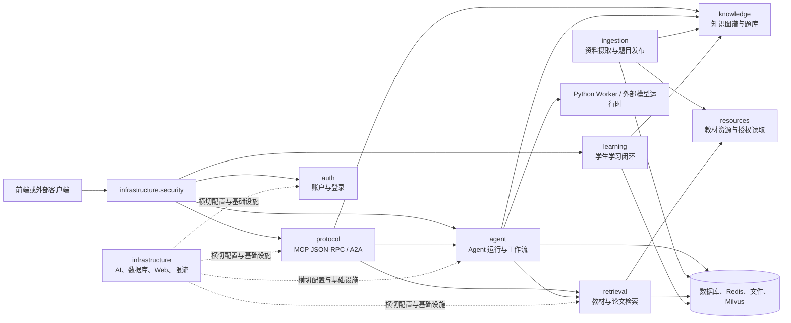

> 按 agent、auth、knowledge、learning、memory、protocol、resources、retrieval、ingestion、infrastructure 划分的 Java 后端模块入口。

# 后端模块地图

Java 后端位于 `backend-java/src/main/java/com/doob/mathagent`，承担控制面职责：接收请求、完成身份与访问控制、组织 Agent 与检索能力、持久化工作流和领域状态，并向 Python Worker 或外部基础设施派发执行任务。Python 运行时负责具体的模型阶段执行；Java 负责执行边界、状态投影、可见性校验和结果对外暴露。

## 总体调用关系



关键边界如下：

- `infrastructure.security` 在请求进入业务模块前解析请求主体、执行访问策略和限流。
- `protocol` 将 MCP 或 A2A 协议请求转换为后端能力调用。
- `agent` 是运行编排和外部 Worker 派发的主要入口。
- `retrieval`、`resources` 和 `knowledge` 分别承担知识获取、资源读取和结构化知识管理。
- `ingestion` 是离线或批处理写入链路，不应与在线检索链路混淆。
- `learning` 保存学生学习状态，并通过评分策略产生下一步反馈。
- `auth` 负责账户生命周期和登录，不替代基础设施层的请求级访问控制。

## `agent`：Agent 注册、运行编排与 Worker 控制面

`agent` 是后端中最宽的业务入口，包含 Agent 能力目录、运行计划、执行控制、追踪、Worker 节点和多智能体写作工作流。

主要入口包括：

- `AgentRegistryController`：Agent 注册与能力发现。
- `AgentModelCatalogController`：模型目录。
- `AgentModelHealthController`：模型健康状态。
- `AgentRunPlanController`：解析运行请求并生成执行计划。
- `AgentRunExecutionController`：执行运行计划并投影响应。
- `AgentTraceController`：查询运行追踪、诊断和用量摘要。
- `AgentWorkerNodeController`：Worker 节点注册与心跳。
- `KnowledgeRetrievalAgentController`：将知识检索封装为 Agent 入口。
- `AgentToolBrokerController`：为外部工具调用提供资源读取、资产读取和搜索能力。
- `MultiAgentWritingController`：手册生成工作流的同步、异步和状态查询入口。

运行链路通常是：

```text
请求
  -> AgentRunPlanController
  -> 运行计划服务
  -> AgentRunExecutionController
  -> 并发租约与预算控制
  -> Python Agent 或 Worker
  -> TraceStore / 工作流存储
  -> 响应投影
```

多智能体手册生成由 `MultiAgentWritingService` 作为 Java 控制面门面。其职责边界在源码中明确：

- 规范化请求。
- 检查实时模型执行开关。
- 将请求主体规范化，并要求教师或管理员权限。
- 检查 Python 手册运行时配置。
- 创建或恢复 Java 所有的工作流记录。
- 异步场景通过 `AgentWorkerTaskDispatchService` 发布一个不透明的 Python Worker 命令。
- 执行完成后，将有限的 Python 结果转换为工作流、响应和制品合同。
- Java 不负责规划或执行 Python 内部的 provider stage。

异步工作流的关键状态至少包括：

- `RUNNING`：工作流已创建或已排队。
- `COMPLETED`：结果可直接复用，重复投递不会再次执行。
- `FAILED`：Worker 重试耗尽后，Java 将任务标记为失败。
- 阶段记录和 `TeachingEvidence`：保存初始证据、阶段状态和结果摘要。

带 `clientRequestId` 的异步提交会根据认证主体和请求 ID 派生稳定的 `workflowId`。重复请求先调用可见性范围内的工作流查询，命中后直接返回已有记录，从而避免再次入队。

主要持久化对象包括：

- `AgentRunTraceEntity`
- `AgentWorkerNodeEntity`
- `AgentWorkerTaskEntity`
- `AgentWorkerTaskOutboxEventEntity`
- `MultiAgentWritingWorkflowEntity`

扩展点包括：

- Agent 注册与模型目录可增加新的能力或模型提供方。
- 运行计划和执行服务可以扩展新的 Agent 类型。
- 并发租约和预算策略可替换，但必须保持租约释放、超限和失败投影的一致性。
- Worker 派发通过任务服务和 Outbox 边界扩展，不应由业务控制器直接操作消息队列。
- Python 工作流可以扩展内部节点，但 Java 侧应继续只依赖稳定的任务和结果合同。

## `auth`：账户、密码和登录

`auth` 负责本地账户体系和认证相关业务：

- `AuthController`：登录、注册及教师账户创建入口。
- `AuthService`：账户认证和账户操作门面。
- `PasswordHashService`：密码哈希与校验。
- `LocalAccountStore`：账户存储抽象。
- `MyBatisLocalAccountStore`：数据库实现。
- `CompositeLocalAccountStore`：组合多个本地账户来源。
- `LocalAcceptanceAccountBootstrap`：本地验收或初始化账户准备。
- `AuthAccountEntity` 与 `AuthAccountMapper`：数据库持久化模型。

主要调用链为：

```text
AuthController
  -> AuthService
  -> PasswordHashService
  -> LocalAccountStore
  -> MyBatisLocalAccountStore
  -> AuthAccountEntity
```

边界条件：

- 登录、注册和教师账户创建使用不同 DTO，不能将账户创建权限等同于普通注册权限。
- 认证成功后形成请求主体，后续由 `infrastructure.security` 解析并执行 API 级访问策略。
- 多种账户存储实现可以组合，但必须保持账户唯一性、密码校验和身份字段的一致语义。

## `knowledge`：知识图谱与题库

`knowledge` 管理结构化知识和题目之间的关系，主要入口包括：

- `KnowledgeGraphSpineController`
- `KnowledgeQuestionBankController`
- `KnowledgeGraphSpineService`
- `KnowledgeGraphSpineSeedService`

主要实体包括：

- `KnowledgePointEntity`：知识点。
- `KnowledgeRelationEntity`：知识点之间的关系。
- `QuestionBankItemEntity`：题库题目。
- `QuestionKnowledgeLinkEntity`：题目与知识点的关联。

典型链路为：

```text
知识点或题库请求
  -> Controller
  -> KnowledgeGraphSpineService
  -> Mapper
  -> Entity
```

`KnowledgeGraphSpineSeedService` 负责知识图谱骨架或初始数据准备。`KnowledgeRetrievalAgentController` 则位于 `agent` 入口，向上层 Agent 暴露知识检索能力；真正的教材文本、页面或论文检索由 `retrieval` 负责。

扩展知识关系或题型时，应通过实体、Mapper 和服务层增加领域语义，避免让协议层或 Agent 控制器直接依赖数据库结构。

## `learning`：学生学习闭环

`learning` 以 `StudentLearningLoopService` 为核心，组织：

1. 学生学习尝试记录。
2. 学习结果评分。
3. 知识掌握度更新。
4. 下一步学习反馈。

评分逻辑由 `StudentLearningScoringPolicy` 抽象，说明评分和掌握度变化是可替换策略边界，而不是固定在服务流程中的实现细节。

状态持久化由 `StudentLearningLoopStore` 抽象，当前证据显示同时存在：

- 内存实现：适合测试或轻量运行。
- MyBatis 数据库实现：适合持久化部署。

典型调用链为：

```text
学习尝试
  -> StudentLearningLoopService
  -> StudentLearningScoringPolicy
  -> StudentLearningLoopStore
  -> 掌握度与下一步反馈
```

关键边界：

- 评分策略变更会改变掌握度，应保持策略版本或至少保证历史状态可解释。
- 内存 Store 与数据库 Store 必须遵守同一状态读写契约。
- 学习反馈应基于当前认证主体读取，不能将学生状态查询开放为任意主体可读。

## `memory`：记忆能力边界

当前已读源码证据中没有展开 `memory` 包的具体文件树或类级实现，因此这里只能确认它属于页面规划中的独立后端模块，不能从现有证据进一步指定具体入口类、存储模型或状态字段。

从模块边界上，`memory` 应与以下职责保持区分：

- 不替代 `knowledge` 的教材、题库和知识图谱持久化。
- 不替代 `agent` 的运行追踪和工作流状态。
- 不替代 `learning` 的学生掌握度状态。
- 若被 Agent 使用，应通过稳定的服务接口提供读写，而不是让 Agent 控制器直接访问其存储实现。

具体扩展前需要先补充该包的源码证据，包括入口服务、Store、实体和可见性规则。

## `protocol`：MCP 与 A2A 协议适配

`protocol` 将外部协议请求接入 Java 后端能力，主要入口包括：

- `McpJsonRpcController`：MCP JSON-RPC 请求入口。
- `McpDiscoveryController`：协议能力发现。
- `McpToolExecutionController`：工具调用入口。
- `McpKeyController`：MCP 客户端密钥管理。
- `A2aAgentCardController`：A2A Agent Card。
- `McpJsonRpcService`：JSON-RPC 请求解析、方法分派和响应构造。
- `ProtocolDiscoveryService`：生成工具、资源和提示描述。
- `McpToolExecutionService`：执行具体工具能力。
- `McpClientKeyService`：客户端密钥生命周期。
- `McpClientResolver` 与 `McpAccessPolicy`：客户端解析和访问策略。

MCP 调用链为：

```text
McpJsonRpcController
  -> McpJsonRpcService
  -> 客户端解析与访问策略
  -> ProtocolDiscoveryService 或 McpToolExecutionService
  -> Agent Tool Broker / Knowledge / Retrieval
  -> JSON-RPC response
```

客户端密钥支持内存和 MyBatis 两种 Store：

- `InMemoryMcpClientKeyStore`
- `MyBatisMcpClientKeyStore`

关键状态包括客户端密钥的创建、启用或撤销，以及工具调用的成功、参数错误和业务失败响应。协议层必须保持 JSON-RPC 合同稳定，业务异常应转换为协议可识别的错误，而不是直接泄漏内部异常。

`ProtocolDiscoveryService` 是扩展协议能力的主要位置。新增工具、资源或提示时，需要同步更新：

- 描述符。
- 输入 Schema。
- 执行路由。
- 客户端访问策略。
- 错误和可见性行为。

A2A Agent Card 与 MCP 发现目录分别服务于 Agent 能力卡片和协议能力目录，两者不是同一份响应模型。

## `resources`：教材资源目录与受控读取

`resources` 为检索和上层 Agent 提供教材资源抽象，已知入口类型包括：

- `TextbookBookRootResolver`：解析教材根目录。
- `TextbookCatalogReader`：读取教材目录项。
- `TextbookCatalogItem`：目录资源模型。
- `TextbookChunkReader`：读取文本块。
- `TextbookChunk`：分块模型。
- `TextbookPageImageService`：页面图片资源服务。

资源调用链为：

```text
教材资源请求
  -> 根目录解析
  -> 目录读取
  -> chunk 或页面资源读取
  -> 授权读取
  -> retrieval / Agent Tool Broker
```

资源读取必须经过授权边界，不能仅凭文件路径直接读取。页面图片服务由检索页面图片接口和 Agent Tool Broker 共同使用，适合扩展页面预览、资产读取和工具侧资源访问。

此外，飞书资源接入位于根包下的 `feishu`，包括：

- `FeishuOAuthController`
- `FeishuOAuthService`
- `FeishuCredentialService`
- `FeishuCredentialCipher`
- `FeishuResourceBindingService`

飞书凭证以加密形式持久化，资源绑定用于维护外部资源与系统对象之间的关联。OAuth 回调、令牌交换、凭证读取和资源绑定应保持分层，避免控制器直接接触明文凭证或 Mapper。

## `retrieval`：教材和数学论文检索

`TextbookRetrievalService` 是教材检索总入口，依赖：

- `TextbookCatalogReader`
- `TextbookChunkReader`
- `LocalTextbookBm25SearchEngine`
- `TextbookSearchCache`
- `RetrievalAuditSink`
- `TextbookPageImageSearchService`
- `TextbookPageTextSearchService`
- `TextbookPageImageService`
- `TextbookMilvusSearchClient`
- `VectorIndexService`
- `TeacherResourceGraphAlignmentService`

核心链路是多阶段检索：

```text
TextbookRetrievalController
  -> TextbookRetrievalService
  -> 请求规范化与检索模式选择
  -> 目录 / chunk 加载
  -> BM25 与页面文本、图像或向量候选
  -> 融合与重排
  -> 缓存
  -> 审计
  -> TextbookSearchResponse
```

源码明确显示的运行状态和保护机制包括：

- `cachedCorpus`：最近一次成功加载的教材语料快照。
- `lastLoadFailure`：最近一次加载失败状态。
- `corpusLoadLock`：防止缓存未命中时并发加载大量文件。
- 失败冷却窗口为 30 秒，避免底层文件异常时每个请求重复触发昂贵加载。
- 搜索管线版本 `SEARCH_PIPELINE_VERSION` 和缓存 Schema 版本用于隔离排序、候选准入和重排逻辑变化。
- 查询会剥离教材检索包装词，但保留“函数定义”等真实主题词。
- 公式、编号和函数名等词法信号会影响 BM25 候选准入。

检索模式由 `TextbookRetrievalMode` 和 `TextbookRetrievalProperties` 控制，缓存可使用：

- `RedisTextbookSearchCache`
- `DisabledTextbookSearchCache`

`TextbookRetrievalWarmup` 负责预热。页面级能力由以下组件承载：

- `TextbookPageTextSearchService`
- `TextbookPageImageSearchService`
- `TextbookPageImageSearchController`

论文检索由以下组件组成：

- `CanonicalMathPaperCorpusAdapter`：规范化数学论文语料。
- `CanonicalMathPaperAuthorizedBlockReader`：授权读取论文块。
- `CanonicalMathPaperRetrievalService`：受控检索入口。
- `CanonicalMathPaperAssetService`：论文资产访问。

检索审计通过 `RetrievalAuditSink` 抽象，当前证据包含：

- `JdbcRetrievalAuditSink`
- `CompositeRetrievalAuditSink`
- `RecentRetrievalAuditStore`
- `RetrievalAuditController`
- `RetrievalAuditEvent`
- `RetrievalAuditHit`

扩展检索排序、候选准入或缓存结构时，必须同步更新缓存身份版本，否则旧结果可能在服务重启后继续返回。缓存禁用、向量后端不可用、教材文件加载失败和页面质量不满足要求，都可能改变结果数量或降级到其他检索路径。

## `ingestion`：资料摄取与题目发布

`ingestion` 是从源文件到知识库题目的批处理主链路，核心入口是 `IngestionBatchRunner`。主要阶段包括：

```text
参数解析与预检
  -> 源文件发现
  -> DOCX 转 PDF
  -> PDF 页面渲染
  -> 图像优化
  -> 题号识别与题目区域检测
  -> 公式规范化
  -> 证据生成
  -> 重复判定
  -> 人工审核
  -> 发布决策
  -> 题目与证据写入知识库
```

主要文件和职责：

- `IngestionCommandArguments`：命令行参数。
- `IngestionProperties`：Spring 配置属性。
- `IngestionPreflightService`：启动前检查。
- `IngestionSourceFileDiscoverer`：发现源文件。
- `DocxToPdfRenderer`：将 DOCX 转换为 PDF。
- `PdfEvidencePageRenderer`：渲染 PDF 页面证据。
- `PdfQuestionRegionDetector`：检测题目区域。
- `QuestionNumberDetector`：识别题号。
- `FormulaCanonicalizer`：统一公式表示。
- `QuestionOccurrenceIdentity`：生成题目出现身份。
- `DeduplicationDecisionGate`：执行去重门禁。
- `IngestionReviewQueueService`：管理人工审核队列。
- `PublicationDecision`：发布决策。
- `AnswerEvidence` 与 `AnswerProvenance`：保存答案证据和来源。

任务状态由 `ImportRunState`、`ImportRunProgress` 和 `ImportVerificationState` 共同描述。题目是否进入知识库，不能只由识别成功决定，还要经过：

1. 题目身份判定。
2. 重复决策。
3. 公式或文本候选审核。
4. 发布门禁。

人工复核入口为：

- `IngestionReviewController`
- `IngestionReviewDecisionRequest`
- `IngestionReviewQueueService`

边界条件包括源文件缺失、DOCX 转换失败、PDF 页面渲染失败、题号识别不确定、公式候选需要人工确认、题目重复以及证据不足。任何阶段失败都应反映到批次进度和验证状态，不能将未验证结果直接发布。

论文来源还由以下模型和策略组织：

- `PaperMetadata`
- `PaperCitation`
- `PaperType`
- `PaperTypeRegistry`
- `PaperTypePolicy`

新增输入格式、题型或去重规则时，应优先扩展对应策略或阶段组件，保持 `IngestionBatchRunner` 只负责流程编排和状态推进。

## `infrastructure`：横切基础设施

### AI 配置

`infrastructure.ai` 提供模型和提供方目录：

- `AiProviderProperties`
- `AiProviderCatalog`
- `AiModelPriceCatalog`

这些组件为 Agent 执行、预算控制和 Python 路由提供配置基础。提供方路由还受到 `ProviderRouteGrantSigner`、Python 客户端和运行时配置约束，Java 到 Python 或模型提供方的调用不能绕过授权签名边界。

### 安全与访问控制

`infrastructure.security` 负责请求级安全：

- `ApiAccessControlFilter`
- `ApiAccessControlService`
- `ApiAccessPolicy`
- `ApiAccessRule`
- `ApiAccessDecision`
- `RequestSubjectResolver`
- `SaTokenRequestSubjectResolver`
- `RequestSubject`
- `ApiRateLimiter`

访问控制链为：

```text
HTTP 请求
  -> ApiAccessControlFilter
  -> RequestSubjectResolver
  -> ApiAccessPolicy
  -> ApiAccessDecision
  -> ApiRateLimiter
  -> Controller
```

限流支持固定窗口和 Redis 实现：

- `FixedWindowRateLimiter`
- `RedisFixedWindowRateLimiter`
- `RedisRateLimitCounter`
- `StringRedisRateLimitCounter`

扩展访问规则时，应同时考虑认证主体、API 访问级别、角色权限和限流维度。业务服务仍需执行自身的资源可见性检查；例如工作流查询必须按认证主体限制可见范围，不能只依赖路由层的通用权限。

### 数据库与 Web

数据库初始化和迁移由：

- `DatabaseMigrationProperties`
- `DatabaseMigrationRunner`

负责。各业务模块普遍采用 Entity、Mapper、Store 或 Service 分层，数据库 Mapper 不应成为控制器的直接依赖。

Web 横切组件包括：

- `GlobalApiExceptionHandler`
- `ApiErrorResponse`
- `HttpCorsConfiguration`

`GlobalApiExceptionHandler` 将内部异常转换为统一 API 错误响应，是协议入口和普通 REST 入口之间的重要错误投影边界。

### 文本处理

- `FormulaMarkupSanitizer`：清理和约束公式标记。
- `TextEncodingRepair`：修复文本编码问题。

这些组件同时影响摄取、检索和教学内容投影，修改时需要关注公式可读性、原文保真度以及下游缓存或证据引用的稳定性。

## 模块边界与扩展原则

- 控制器只负责协议或 HTTP 输入输出，业务编排放在 Service。
- `agent` 负责运行控制和结果投影，Python 负责具体模型阶段执行。
- `retrieval` 负责候选发现、融合、重排、缓存和审计；`resources` 负责受控资源读取。
- `knowledge` 负责结构化知识和题库关系，不直接承担文件检索。
- `ingestion` 负责从输入资料生成可发布题目，发布前必须经过身份、去重和审核门禁。
- `auth` 负责账户和登录；请求级访问控制、可见性和限流由 `infrastructure.security` 共同完成。
- 协议层新增能力必须同时补齐发现描述、输入 Schema、执行路由、访问策略和错误响应。
- 所有异步 Worker 任务都应以持久化状态、租约、重试和幂等恢复为边界，避免将消息重复投递误认为业务重复执行。
- 修改检索管线、评分策略、发布决策或 Agent 预算规则时，应同步检查缓存身份、历史状态解释和失败投影。

Sources: [MultiAgentWritingService.java](backend-java/src/main/java/com/doob/mathagent/agent/service/MultiAgentWritingService.java#L25-L135)  
Sources: [TextbookRetrievalService.java](backend-java/src/main/java/com/doob/mathagent/retrieval/TextbookRetrievalService.java#L35-L116)  
Sources: [McpJsonRpcService.java](backend-java/src/main/java/com/doob/mathagent/protocol/service/McpJsonRpcService.java#L1-L220)  
Sources: [agent module](backend-java/src/main/java/com/doob/mathagent/agent)  
Sources: [auth module](backend-java/src/main/java/com/doob/mathagent/auth)  
Sources: [knowledge module](backend-java/src/main/java/com/doob/mathagent/knowledge)  
Sources: [ingestion module](backend-java/src/main/java/com/doob/mathagent/ingestion)  
Sources: [retrieval module](backend-java/src/main/java/com/doob/mathagent/retrieval)  
Sources: [protocol module](backend-java/src/main/java/com/doob/mathagent/protocol)
