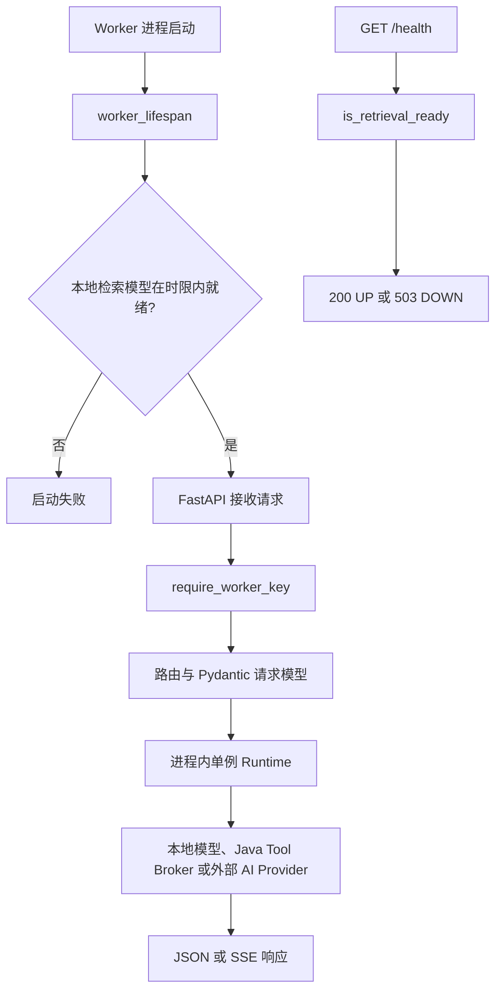
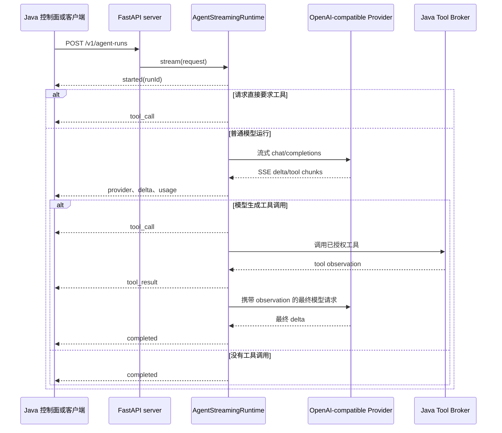

> Python 服务通过 server、运行时模块、流式输出和健康检查对外承载 AI 任务。

# Python Worker 服务入口

Python Worker 是 AI 执行面的 HTTP 服务入口，由 FastAPI 应用统一暴露模型调用、Agent 运行、手册生成、教学草稿、学生讲解、图片转写、检索辅助和提供方健康探测能力。Java 控制面负责租户数据、文件、权限、证据授权和工作流边界；Python 侧接收已经约束过的请求，执行模型或运行时逻辑，并将结果转换为同步响应或 SSE 事件。

## 模块职责

| 模块 | 职责 |
| --- | --- |
| `app/server.py` | 创建 FastAPI 应用、注册 HTTP 路由、校验 Worker API Key、管理运行时单例、编码 SSE 响应 |
| `app/settings.py` | 从环境变量读取 Worker、模型提供方和运行时配置 |
| `app/health.py` | 生成对外安全的健康状态，仅暴露 `UP`/`DOWN` 和服务名 |
| `app/embeddings.py` | 管理本地检索模型、Embedding、CLIP、页面搜索和重排能力，并提供 readiness 状态 |
| `app/agent_runtime.py` | 提供 Agent 同步执行兼容接口，以及工具调用相关的请求与响应模型 |
| `app/streaming_runtime.py` | 执行真正的 Agent 流式模型调用、提供方轮换、工具调用聚合和用量记录 |
| `app/ai_run_runtime.py` | 执行版本化的通用 AI 运行协议 |
| `app/handout_runtime.py` | 执行完整的手册生成图，并维护运行时连接池及持久化 checkpoint |
| `app/teaching_draft_runtime.py` | 执行旧版教学任务草稿契约 |
| `app/workload_runtime.py` | 承接迁出 Java 的非手册模型负载，包括学习意图、图片转写、学生讲解和提供方健康检查 |
| `app/student_explanation_graph.py` | 为 v2 学生讲解请求准备受 token 预算约束的上下文 |
| `app/student_explanation_runtime.py` | 提供学生讲解运行级幂等、终态缓存和事件重放 |
| `app/sse.py` | 解析提供方返回的 SSE 数据块 |
| `app/usage.py` | 汇总实际用量、计算费用，并记录提供方尝试结果 |
| `app/tokenizer.py` | 计算真实 tokenizer 的 token 数量，用于上下文准入 |

## 应用启动与依赖初始化

应用通过 `worker_lifespan` 注册生命周期处理器。服务开始接收请求前，会在工作线程中初始化本地检索模型，并受 `DEFAULT_RETRIEVAL_READINESS_TIMEOUT_SECONDS` 限制：

1. 初始化本地检索模型。
2. 超时则以 `RuntimeError` 终止启动。
3. 配置错误或提供方错误同样阻止服务启动。
4. 初始化成功后进入请求服务阶段。

这意味着本地检索模型属于启动时强依赖，而不是首次请求时才懒加载的可选能力。运行时对象本身通过 `@lru_cache(maxsize=1)` 创建为每个 Worker 进程内的单例，主要包括 Embedding、Agent、通用 AI、流式 Agent、手册、教学草稿、迁移负载和学生讲解运行时。



图中的 `Runtime` 只表示进程内缓存实例，不代表 Python 成为业务数据权威。`AgentRuntime` 的文档明确说明 Python 保持无状态，Java 仍是租户数据和文件的唯一权威。

## 认证与健康检查

除 `/health` 外，主要业务路由都通过 `require_worker_key` 保护。认证支持两种形式：

- `Authorization: Bearer <key>`
- `X-Worker-API-Key: <key>`

服务从环境读取期望的 `MATH_AGENT_WORKER_API_KEY`，使用常量时间比较校验请求值：

- 未配置服务端密钥：返回 `503`。
- 请求没有密钥或密钥不匹配：返回 `401`。
- `/health` 不要求 Worker API Key，用于基础存活和就绪探测。

`/health` 只检查本地检索模型是否 ready，并返回：

```json
{
  "status": "UP",
  "service": "math-agent-rag-worker"
}
```

未就绪时返回相同结构但状态为 `DOWN`，HTTP 状态码为 `503`。健康响应不会泄露模型、设备或 CUDA 细节。

## HTTP 能力分层

### 能力与上下文辅助接口

- `GET /v1/capabilities`：返回 Embedding 服务状态。
- `POST /v1/tokenize`：返回 tokenizer、编码名称、每个文本的 token 数和总数。
- `POST /v1/provider-health/sync`：返回脱敏的模型提供方探测结果。
- `POST /v1/image-transcriptions/sync`：转写 Java 已授权并内联传输的图片，不接受本地路径。

Tokenizer 不可用、缺少依赖或参数非法时，接口返回 `503`，并将错误类型作为有限信息返回，而不是暴露底层详细配置。

### Agent 与通用 AI

- `POST /v1/agent-runs`：生产流式 Agent 接口，以 SSE 返回 typed events。
- `POST /v1/agent-runs/sync`：暂时兼容无法消费 SSE 的调用方。
- `POST /v1/ai-runs/sync`：执行版本化通用 AI 协议，供 Java facade 投影为公共 API。

同步接口直接调用对应 Runtime 并返回结构化结果；流式接口则由 `StreamingResponse` 包装事件生成器，统一设置：

- `Content-Type: text/event-stream`
- `Cache-Control: no-cache`
- `X-Accel-Buffering: no`

### 手册与教学负载

- `POST /v1/handout-runs/sync`：一次 Java 到 Python 请求中执行完整手册生成图。
- `POST /v1/teaching-drafts/sync`：执行一个有界的教学草稿任务。
- `POST /v1/learning-intents/sync`：执行受限的学习意图分类，不接收学生身份或知识库访问权限。

教学草稿接口的证据处理和发布授权仍由 Java 负责，Python 只执行草稿生成。

### 学生讲解

v1 接口：

- `POST /v1/student-explanations/sync`
- `POST /v1/student-explanations/stream`
- `GET /v1/student-explanations/{run_id}/events`

v2 接口：

- `POST /v2/student-explanations/prepare`
- `POST /v2/student-explanations/sync`
- `POST /v2/student-explanations/stream`

v2 请求先经过 `StudentExplanationContextGraph.prepare`，生成受 token 预算限制的上下文摘要或窗口，再转换为已校验的 v1 compose 请求执行。同步响应同时携带 `contractVersion`、准备好的上下文和最终响应。

学生讲解流式接口支持 `Last-Event-ID`：

1. 读取请求头中的事件游标。
2. 游标必须是非负整数，否则返回 `400`。
3. 从指定事件之后继续读取 durable run 事件。
4. 返回带有 `id`、`event` 和 JSON `data` 的 SSE。
5. 断线重连读取已有事件，不重新调用模型提供方。

事件查询接口通过 `afterId` 和 `limit` 分页，`limit` 范围为 1 到 100，并返回 `nextAfterId`。

## Agent 流式调用链

`/v1/agent-runs` 路由将请求交给 `AgentStreamingRuntime.stream`。典型调用链如下：



主要事件包括：

- `started`：运行开始。
- `provider`：当前使用的提供方、模型和尝试次数。
- `delta`：模型输出增量。
- `tool_call`：请求执行工具。
- `tool_result`：工具观察结果已返回。
- `usage`：最终用量和费用信息。
- `completed`：运行成功结束。
- `provider_failed`：当前提供方在尚未输出用户可见内容前失败。
- `error`：无法继续执行。

### 工具调用边界

如果请求显式要求某个工具，运行时首先检查工具是否存在于 `allowedTools`：

- 未授权时发送 `403` 类型的 `error` 事件并结束。
- 已授权时发送 `tool_call`，不会在 Python 内自行扩大工具权限。
- 普通模型调用产生工具请求后，通过 `AgentRuntime._invoke_java_tool_broker` 回到 Java Tool Broker 获取观察结果，再进行最终模型调用。

工具结果会被包装为 `Authorized tool observation`，并作为后续模型输入。

### 提供方轮换与不可重写输出

流式运行支持按配置顺序尝试多个提供方。提供方缺少 key 或 base URL 时记录为配置失败并继续尝试。请求异常、响应解析错误或关键字段错误会记录失败用量事件。

提供方轮换有一个关键边界：一旦已经向客户端发送 `delta`，就不能切换到另一个提供方重写结果。此时若连接中断，直接返回 `503` 的终止错误；只有在尚未产生用户可见文本时，才允许发送 `provider_failed` 并尝试下一个提供方。

用量在提供方流结束后计算：

1. 优先读取提供方 usage。
2. 必要时根据输入消息和输出文本进行 token fallback。
3. 通过 `cost_for` 计算费用。
4. 写入 `UsageLedger`。
5. 发送最终 `usage` 事件。

因此，`usage` 不是每个增量即时发送，而是在最终 usage 信息确定后发送。

## 手册运行与重复提交边界

手册同步接口直接调用 `HandoutRuntime.execute`。服务进程还创建了一个由 `MATH_AGENT_HANDOUT_SSE_WORKERS` 控制大小的线程池，默认并发数为 4。手册流式请求通过运行 ID 复用正在执行的 Future，避免浏览器重连导致同一个图再次执行并重复消耗模型预算。

相关状态包括：

- `_handout_executor`：执行手册图的线程池。
- `_handout_futures`：按 `run_id` 保存当前进程中的 Future。
- `_handout_futures_lock`：保护 Future 映射的并发访问。

该去重状态是进程内状态；持久化恢复能力由 `HandoutRuntime` 的 durable checkpoint 机制承担。部署多个 Worker 进程或多个实例时，不能仅依赖 `_handout_futures` 作为全局幂等存储。

## 关键状态

### 检索 readiness

检索模型 readiness 同时影响：

- 启动是否成功。
- `/health` 的 HTTP 状态码。
- 对外暴露的服务状态。

### Runtime 单例

`@lru_cache(maxsize=1)` 让同一 Python 进程复用运行时对象、连接池或编译后的图。进程重启后这些对象会重新创建，因此持久化运行状态不能依赖 Python 内存。

### 流式运行状态

Agent 流式运行至少维护：

- 当前提供方和尝试次数。
- 已输出的文本片段。
- 聚合中的工具调用片段。
- 当前请求的 usage。
- `UsageLedger` 中的成功或失败尝试。
- 是否已经产生用户可见输出。

`emitted_content` 决定失败后能否继续提供方轮换，是流式一致性的核心状态。

### Durable 学生讲解状态

学生讲解使用运行 ID、事件 ID 和终态缓存支持重连与有限事件重放。`Last-Event-ID` 或 `afterId` 只决定读取位置，不触发新的模型执行。

### 手册 Future 状态

手册 SSE 请求通过 Future 判断当前运行是否仍在执行。正在执行时复用已有 Future；完成后由完成回调清理进程内映射，避免长期保留已结束任务。

## 边界条件

- FastAPI 或 Pydantic 缺失时，服务在导入阶段显式失败。
- Worker API Key 未配置时，受保护接口返回 `503`，而不是允许匿名执行。
- 无效 Worker API Key 返回 `401`。
- 本地检索模型初始化超时或失败时，Worker 不进入可服务状态。
- tokenizer 依赖不可用或输入非法时，返回 `503`。
- `Last-Event-ID` 不是整数时，学生讲解流接口返回 `400`。
- 学生解释事件分页限制为最多 100 条。
- 流式输出一旦跨越 HTTP/SSE 边界，就不能审核、重写或切换提供方。
- Java 授权的证据、学生身份、文件路径和知识库权限不应由 Python 自行补充。
- Python 进程内缓存和 Future 映射不等价于跨实例持久化；跨进程恢复必须依赖运行时 checkpoint 或上层持久化机制。
- 外部模型调用超时由 `MATH_AGENT_AI_RUNTIME_TIMEOUT_SECONDS` 控制，默认 30 秒。

## 扩展点

新增 AI 负载通常需要同时扩展三层：

1. 在独立 Runtime 中定义请求、执行和响应模型。
2. 在 `server.py` 中增加受认证保护的同步或流式路由。
3. 对流式能力复用既有 SSE 编码、事件游标、用量记录和错误投影约定。

扩展时应保持以下约束：

- 使用 `@lru_cache(maxsize=1)` 复用需要连接池、模型或编译图的 Runtime。
- 将租户、文件和权限判断留在 Java 控制面。
- 将工具权限限制在请求携带的 `allowedTools` 或 Java Broker 授权范围内。
- 对可重连任务使用 durable 事件和游标，而不是重新触发 provider 调用。
- 在发送首个可见增量前完成可安全的提供方轮换；发送后只能报告终止错误。
- 对外健康接口只返回安全的 readiness 状态，不泄露底层设备和模型配置。

Sources: [ai-worker-python/app/server.py](ai-worker-python/app/server.py#L1-L557)  
Sources: [ai-worker-python/app/streaming_runtime.py](ai-worker-python/app/streaming_runtime.py#L1-L201)  
Sources: [ai-worker-python/app/health.py](ai-worker-python/app/health.py#L1-L7)
