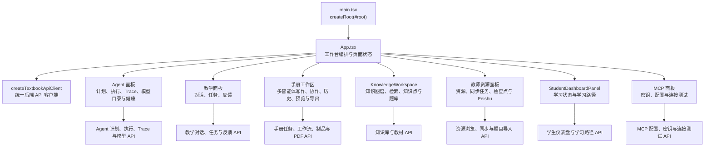
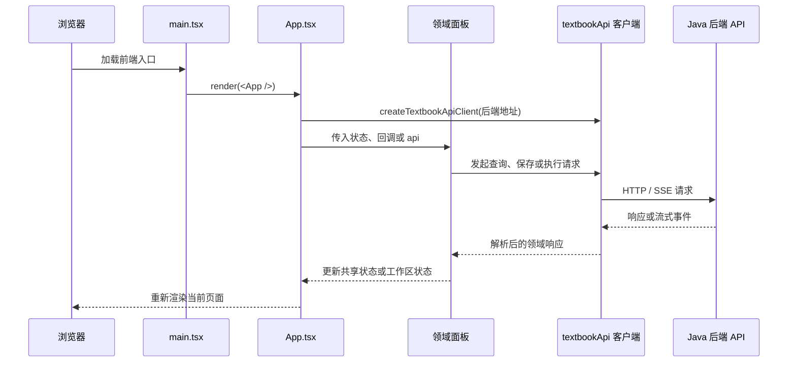

> React 应用由 App.tsx 组织工作台，并通过 agent、教学、手册、知识库、资源和学生面板承载主要用户流程。

# 前端应用入口与页面组织

## 页面定位

前端应用以 React 为基础，由 `main.tsx` 创建根节点并渲染 `App`。`App.tsx` 是工作台级别的页面组织器，负责页面切换、跨模块状态、API 客户端以及主要用户流程的编排；具体交互和展示则下沉到 agent、教学、手册、知识库、资源和学生面板等组件。



`main.tsx` 只承担启动职责：导入全局样式，获取 `root` 元素，并将 `<App />` 挂载到页面。应用级行为集中在 `App.tsx`，因此页面组织、模块之间的状态衔接和后端请求生命周期主要从该文件进入。

## 模块职责

### 应用入口与工作台编排

[main.tsx](frontend/src/main.tsx#L1-L6) 是浏览器入口：

1. 创建 React 根节点。
2. 渲染 `App`。
3. 引入 `styles.css`，提供全局样式。

[App.tsx](frontend/src/app/App.tsx#L216-L233) 初始化 API 客户端和基础页面状态：

- `activePage` 控制当前工作台页面，默认值为 `dashboard`。
- `dropdownOpen` 管理导航下拉菜单。
- `api` 通过 `createTextbookApiClient(DEFAULT_BACKEND_URL)` 创建，并使用 `useMemo` 保持客户端实例稳定。
- 全局查询状态包括教材查询、公式查询、公式图片、选中的教材以及检索模式。
- 检索条数默认值为 `10`，与选定的长篇手册模板的最低发布数量保持一致。

`App.tsx` 同时导入各领域面板，并承担它们之间的数据连接。例如，知识点、知识关系和题库数据既可以由应用层管理，也可以交由独立的 `KnowledgeWorkspace` 管理；这体现了当前应用仍以单一工作台组件作为主要编排边界。

### Agent 流程

Agent 相关能力由以下面板承载：

- `AgentPlanPanel`
- `AgentTracePanel`
- `AgentModelHealthPanel`
- `AgentPanels.tsx`

`App.tsx` 保存 Agent 计划、执行结果、Trace、用量摘要、诊断摘要、模型目录、Agent 注册表和模型健康状态。对应的加载和执行状态也单独维护，包括：

- 计划中：`planningAgent`
- 执行中：`executingAgent`
- Trace 加载中：`loadingAgentTraces`
- 模型健康检查中：`checkingAgentModelHealth`
- 计划、执行和 Trace 错误信息

多智能体写作另外由 `MultiAgentWritingPanel` 承载。应用层维护工作流响应、Trace、制品、制品加载状态、导出状态，以及开始、恢复和轮询状态。这使页面能够表现从任务启动到工作流恢复、制品加载和 PDF 导出的完整状态链。

### 教学流程

教学功能拆分为对话和任务两条主要交互路径：

- `TeachingConversationPanel`：学生或用户与教学 Agent 的持续对话。
- `TeachingTaskPanel`：教学任务及其执行反馈。
- `StudentDashboardPanel`：学生学习状态和闭环反馈。

教学对话状态包括：

- 当前对话 ID和标题。
- 对话摘要列表。
- 对话线程条目。
- 当前输入内容。
- 正在打开的对话 ID。
- 公式图片草稿、预览 URL、上传状态和上传错误。

教学会话线程会从浏览器存储中恢复；任务历史则由后端查询，并根据会话所有权提供可见数据。对话图片上传受 `MAX_FORMULA_IMAGE_BYTES` 限制，当前上限为 `5 * 1024 * 1024` 字节。

### 手册协作工作区

手册相关 UI 由多个组件共同组成：

- `MultiAgentWritingPanel`：发起多智能体写作。
- `HandoutCollaborationPanel`：协作线程和过程状态。
- `HandoutHistorySidebar`：历史任务和恢复入口。
- `HandoutWorkspacePreviewPanel`：工作区预览。
- `PdfCanvasPreview`：PDF 预览。
- `TeacherResourcePanel`：为手册提供教师资源上下文。

`App.tsx` 管理手册任务、模板、历史、预览、反馈和导出相关状态，包括：

- 当前教学任务和教学模板。
- 手册版本、操作状态和导出消息。
- LaTeX 预览内容及其任务 ID。
- PDF URL、PDF 字节数据及 PDF 元信息。
- 历史任务列表和历史任务加载状态。
- 教师反馈评分、决策、评论、提交状态及反馈历史。
- 多智能体工作流、工作流 Trace、制品和制品 PDF。
- 新建、恢复和轮询工作流的状态。

默认模板为 `zhao_lixian_2025_master_v1`。已有任务会同步其不可变模板快照；模板货架则用于主动选择其它模板。手册水印文本属于任务元数据，主要用于 PDF 布局和后续重新导出，并不作为模型生成输入。

手册工作区本身是临时状态，任务历史和恢复数据由后端负责查询。浏览器侧只保存恢复所需的任务标识或原始请求信息，不保存模型输出。应用还使用 `activeTeachingStreamTaskIdRef` 防止旧的 SSE 连接将任务卡片写入新的手册工作区。

### 知识库工作区

[KnowledgeWorkspace.tsx](frontend/src/app/knowledge/KnowledgeWorkspace.tsx#L48-L77) 是知识库和题库的独立工作区组件，接收 `App` 创建的 API 客户端：

```ts
type KnowledgeWorkspaceProps = {
  api: TextbookApiClient;
};
```

它在组件内部维护：

- 知识图谱响应。
- 知识点和知识关系。
- 题库问题。
- 向量索引状态。
- 文本检索和题目检索输入。
- 新增知识点和题目的表单状态。
- 当前检索结果和检索模式。
- 加载、搜索、保存和错误状态。
- 图谱是否准备完成。

知识图谱由节点和边组成，节点按 `MODULE`、`TOPIC`、`METHOD` 配置不同的半径和标签样式。组件通过模拟节点引用、动画帧引用、SVG 引用、悬停节点、缩放和画布平移状态支持图谱交互。

知识库工作区的职责边界是前端知识交互和视图状态，不直接承担检索算法或索引构建逻辑。检索模式包括：

- `hybrid`
- `text_bge`
- `formula_bge`
- `image_clip`

后端返回的检索结果、向量索引状态、知识关系和题库数据由组件呈现或继续触发后续操作。

### 教师资源面板

`TeacherResourcePanel` 负责教师侧资源浏览和资源同步交互。`App.tsx` 保存：

- 教师资源文档列表。
- 按资源 ID 索引的同步任务。
- 按资源 ID 索引的同步检查点。
- 资源搜索关键词。
- 资源块搜索结果和审计事件。
- Feishu 发现查询和发现结果。
- 教师资源错误状态。

`SyncCheckpointView` 用于呈现同步检查点。`canLoadTeacherResourceSyncJobs` 作为可见性边界，控制当前主体是否可以加载教师资源同步任务，说明资源同步数据不是对所有前端用户无条件开放的。

### 学生面板

`StudentDashboardPanel` 展示学生学习状态，应用层保存：

- `studentDashboard`：学生仪表盘数据。
- `studentLearningPath`：学习路径数据。
- `dashboardStudentId`：当前仪表盘对应的学生标识。
- `studentDashboardError`：加载失败信息。

学生面板是学习闭环的主要前端承载，具体评分、掌握度更新和学习状态持久化属于后端学习模块。前端负责选择学生上下文、加载响应并将状态反馈给用户。

### MCP 配置面板

MCP 相关组件包括：

- `McpConfigurationPanel`
- `McpConfigurationForm`
- `McpKeyVaultPanel`
- `McpConnectionTestPanel`
- `McpIdentityBoundaryCard`

`App.tsx` 管理客户端密钥列表、最新创建的密钥、MCP 配置、创建和加载状态、密钥撤销状态、复制提示、配置错误、连接测试状态及测试结果。

密钥创建、撤销、配置读取和连接测试均通过 API 客户端完成；身份边界卡片用于在前端呈现 MCP 访问边界。实际客户端认证和授权仍属于后端职责，前端状态不能替代服务端校验。

## 调用链

典型的前端调用链如下：



其中，`App.tsx` 是导航和跨面板状态的中心；`KnowledgeWorkspace` 明确接收 API 客户端，其他面板通过应用层注入数据、事件处理器或相关状态参与工作台流程。

手册和教学对话还包含流式路径：

1. 页面提交任务或发送对话请求。
2. 前端建立或使用 SSE 流接收增量事件。
3. 事件更新当前任务卡片、对话线程或协作状态。
4. 流传输中断时，使用恢复任务标识进行后续查询。
5. 正常任务进度主要由事件驱动，轮询只在 SSE 传输中断后使用，轮询延迟为 `5_000` 毫秒。

## 关键状态组织

`App.tsx` 的状态可以按职责分为几组：

| 状态组 | 代表状态 | 用途 |
| --- | --- | --- |
| 导航 | `activePage`、`dropdownOpen` | 控制当前工作台页面和导航菜单 |
| 教材检索 | `query`、`formulaQuery`、`selectedTextbookIds`、`textbookRetrievalMode`、`searchResult` | 组织文本、公式、图像和混合检索 |
| 教学 | `teachingQuestion`、`teachingTask`、`teachingConversationEntries` | 组织讲题任务和持续对话 |
| 手册 | `teachingTemplates`、`teachingHistory`、`handoutVersion`、`handoutPreviewLatex` | 组织模板、历史、预览和版本 |
| 多智能体工作流 | `multiAgentWorkflow`、`multiAgentArtifact`、`multiAgentWorkflowTraces` | 组织异步工作流、Trace 和制品 |
| Agent | `agentPlan`、`agentExecution`、`agentTraces` | 组织计划、执行和诊断 |
| 资源 | `teacherResources`、`teacherSyncJobs`、`teacherSyncCheckpoints` | 组织教师资源及同步状态 |
| 知识库 | `knowledgePoints`、`knowledgeRelations`、`questionBankItems` | 组织知识点、关系和题库 |
| 学生 | `studentDashboard`、`studentLearningPath` | 展示学习状态和路径 |
| MCP | `mcpKeys`、`mcpConfiguration`、`mcpTestResult` | 管理外部协议连接配置 |
| 错误与加载 | 各领域 `Error`、`loading`、`polling`、`submitting` 状态 | 将请求生命周期投影到页面 |

这些状态大多使用 `useState` 管理；API 客户端使用 `useMemo` 创建，DOM 和流式连接相关引用使用 `useRef` 管理。组件目录中存在大量针对面板、状态转换和恢复逻辑的测试，说明交互状态和恢复行为是当前前端的重要维护边界。

## 持久化与恢复边界

浏览器存储用于保留少量恢复信息：

- 多智能体工作流 ID。
- 多智能体工作流原始请求。
- 教学对话线程。
- 教学任务恢复信息。
- 旧版本遗留的教学任务和手册协作键。

手册恢复设计明确区分浏览器状态和服务端状态：

- 服务端拥有工作流进度。
- 浏览器只保留原始输入或任务 ID，避免刷新后重复发起一个新的付费请求。
- 模型输出不写入浏览器恢复存储。
- 任务历史通过后端并按会话所有权查询。
- 已完成或终态任务应清理可恢复状态。

这意味着前端恢复入口不能被视为完整的任务数据库；它只是帮助页面重新定位后端任务。

## 边界条件

### 后端地址

应用优先使用构建时的 `VITE_BACKEND_URL`。如果未配置：

- 服务端环境使用空字符串。
- 浏览器环境使用 `window.location.origin`。

因此本地开发可以依赖 Vite 代理进行同源请求，部署环境也可以显式指定后端地址。

### 流式请求中断

正常任务进度由 SSE 事件驱动。只有在 SSE 传输中断后，前端才使用延迟轮询恢复任务状态。旧 SSE 连接不能覆盖新工作区，`activeTeachingStreamTaskIdRef` 用于隔离不同任务的流式更新。

### 模板与任务一致性

新任务默认使用指定的 Zhao 模板，并将请求数量初始化为 `10`。服务端仍是最终校验方：

- 前端默认值减少明显无效请求。
- 模板可能存在最低题目数量要求。
- 服务端负责模板允许列表和模型路由校验。
- 已持久化任务使用自身的不可变模板快照，而不是随后改变的页面选择。

### 上传大小

公式图片上传不能超过 `5 MB`。前端需要在提交前保持该边界；即使前端进行了限制，服务端仍应继续执行最终大小和内容校验。

### 数据可见性

教师资源同步任务受 `canLoadTeacherResourceSyncJobs` 控制。学生数据、教师资源、工作流历史和反馈历史都涉及主体范围，页面展示状态不能绕过后端认证、授权和所有权约束。

### 空数据与未完成状态

知识图谱在数据为空时以空节点和空边处理；图谱准备状态单独由 `graphReady` 表示。各面板同时维护加载、错误和空响应状态，扩展新流程时应保持这三类状态的区分，避免将“尚未加载”“加载失败”和“确实没有数据”混为一谈。

## 主要文件

- [frontend/src/main.tsx](frontend/src/main.tsx#L1-L6)：React 应用入口和根节点挂载。
- [frontend/src/app/App.tsx](frontend/src/app/App.tsx#L216-L350)：工作台编排、页面状态、API 客户端和跨模块流程。
- [frontend/src/app/knowledge/KnowledgeWorkspace.tsx](frontend/src/app/knowledge/KnowledgeWorkspace.tsx#L1-L77)：知识图谱、检索、知识点和题库工作区。
- `frontend/src/app/components/AgentPanels.tsx`：Agent 计划、执行、Trace 和模型状态面板。
- `frontend/src/app/components/TeachingConversationPanel.tsx`：教学对话及流式交互。
- `frontend/src/app/components/TeachingTaskPanel.tsx`：教学任务和反馈交互。
- `frontend/src/app/components/MultiAgentWritingPanel.tsx`：多智能体手册写作入口。
- `frontend/src/app/components/HandoutCollaborationPanel.tsx`：手册协作线程。
- `frontend/src/app/components/HandoutHistorySidebar.tsx`：手册历史和任务恢复。
- `frontend/src/app/components/HandoutWorkspacePreviewPanel.tsx`：手册工作区预览。
- `frontend/src/app/components/TeacherResourcePanel.tsx`：教师资源和同步状态。
- `frontend/src/app/components/StudentDashboardPanel.tsx`：学生仪表盘和学习反馈。
- `frontend/src/app/components/McpPanels.tsx`：MCP 配置、密钥管理和连接测试。
- `frontend/src/app/handoutWorkspaceState.ts`：手册工作区状态转换。
- `frontend/src/app/handoutTaskRecovery.ts`：可恢复手册任务的浏览器状态管理。
- `frontend/src/app/teacherResourceSyncVisibility.ts`：教师资源同步任务的前端可见性判断。
- `frontend/src/shared/api/textbookApi.ts`：前端领域 API 类型和客户端工厂。

## 扩展点

新增页面时，主要扩展点位于 `App.tsx` 的页面标识、导航项、页面状态和页面渲染分支。建议将页面内部的请求状态、表单状态和视图交互放入独立组件，仅将跨页面共享的数据和流程回调保留在 `App.tsx`。

新增领域能力时，可以沿用现有边界：

1. 在 `shared/api/textbookApi` 中增加类型和 API 方法。
2. 在 `app/components` 或 `app/<domain>` 下创建领域面板。
3. 由 `App` 决定页面入口和跨模块数据连接。
4. 对需要恢复的异步任务，仅持久化任务标识和必要的原始请求信息。
5. 对流式任务增加任务 ID 隔离，避免旧连接更新新工作区。
6. 为加载、错误、空数据、终态和恢复状态补充独立测试。

当前架构适合继续承载多领域工作台，但 `App.tsx` 已聚合大量状态和流程。后续扩展如果继续直接增加顶层状态，页面编排和领域逻辑的耦合会进一步扩大；可以优先把完整的领域流程封装为自包含工作区，再由 `App` 负责导航、API 客户端和必要的共享上下文。

Sources: [frontend/src/main.tsx](frontend/src/main.tsx#L1-L6), [frontend/src/app/App.tsx](frontend/src/app/App.tsx#L1-L260), [frontend/src/app/App.tsx](frontend/src/app/App.tsx#L216-L350), [frontend/src/app/knowledge/KnowledgeWorkspace.tsx](frontend/src/app/knowledge/KnowledgeWorkspace.tsx#L1-L180)
