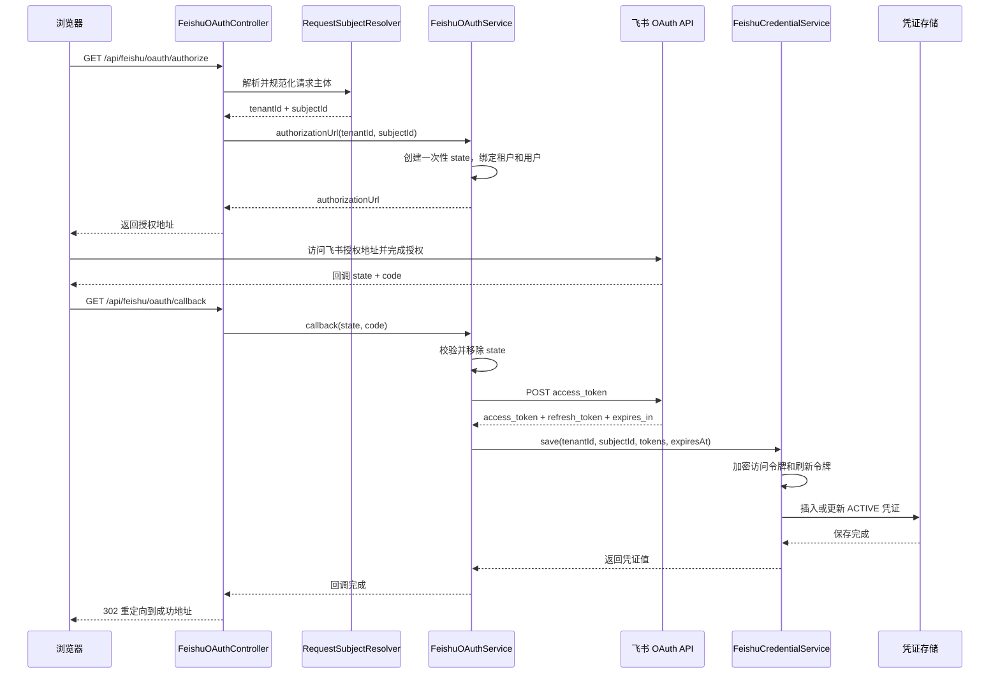

> FeishuOAuthController 和 FeishuOAuthService 负责外部授权回调、令牌交换及用户关联流程。

# 飞书 OAuth 授权流程

飞书 OAuth 模块为已登录系统用户提供飞书个人授权能力，并将授权结果绑定到当前租户和用户。核心职责由 `FeishuOAuthController` 与 `FeishuOAuthService` 分担：

- `FeishuOAuthController`：提供浏览器访问的授权、回调和状态查询接口；解析当前请求主体；只返回授权地址、状态和重定向响应，不向浏览器暴露应用密钥或飞书令牌。
- `FeishuOAuthService`：生成飞书授权地址、创建和校验 OAuth `state`、向飞书交换访问令牌，并调用凭证服务保存用户授权结果。
- `FeishuCredentialService`：作为下游凭证边界，负责按租户和用户查找凭证、加密令牌、更新或插入凭证记录，以及读取有效凭证。

## 模块职责

### Controller：浏览器端 OAuth 边界

Controller 暴露三个 GET 接口：

| 接口 | 作用 | 结果 |
| --- | --- | --- |
| `/api/feishu/oauth/authorize` | 为当前登录用户生成飞书授权地址 | 返回 `authorizationUrl` |
| `/api/feishu/oauth/callback` | 接收飞书返回的 `state` 和 `code` | 完成令牌交换后重定向到成功地址 |
| `/api/feishu/oauth/status` | 查询当前用户的飞书授权状态 | 返回授权状态和过期时间 |

授权入口和状态入口都会通过 `RequestSubjectResolver` 解析并规范化请求主体，然后要求主体具有有效的用户身份。用户主体为空、主体类型为 `anonymous` 时，接口返回 `401 Unauthorized`。

回调接口不重新解析登录用户，而是依赖 OAuth `state` 恢复授权发起时绑定的租户和用户。这使得回调可以在飞书浏览器跳转场景下完成用户关联，同时避免直接相信浏览器提交的用户标识。

### Service：授权协议与令牌交换

`FeishuOAuthService` 持有运行时配置、凭证服务、JSON 解析器和 HTTP 客户端。它不直接将令牌返回给 Controller，而是把令牌交给 `FeishuCredentialService` 保存。

授权地址包含以下信息：

- 飞书应用 ID；
- 配置的 OAuth 回调地址；
- 一次性 `state`；
- 只读权限范围。

默认权限范围为：

```text
drive:drive:readonly
drive:drive.metadata:readonly
docx:document:readonly
```

权限范围可通过 `FEISHU_OAUTH_SCOPES` 覆盖。源码注释明确区分了文件夹元数据与文件内容权限，并以只读权限支持递归读取场景。

## 调用链



关键节点如下：

1. 授权开始前，系统主体由后端请求上下文确定，而不是由前端传入。
2. `state` 在服务端内存中保存租户、用户和过期时间，默认有效期为 300 秒。
3. 飞书回调只提交 `state` 和授权码 `code`，服务端通过 `state` 恢复授权上下文。
4. 服务端使用应用密钥向飞书换取令牌。
5. 令牌交给凭证服务加密后持久化，Controller 不返回令牌。
6. 成功后 Controller 返回 HTTP `302 Found`，目标地址由 `FEISHU_OAUTH_SUCCESS_REDIRECT_URI` 配置，默认值为 `/`。

## 关键状态

### OAuth Pending State

待完成的授权状态由 `PendingState` 表示，包含：

- `tenantId`：授权所属租户；
- `subjectId`：授权所属用户；
- `expiresAt`：状态过期时间。

状态存储在 `ConcurrentHashMap<String, PendingState>` 中，键为随机生成的 UUID。

回调处理时首先执行 `states.remove(state)`，因此状态具有一次性消费特征：

- 不存在的 `state` 会被视为过期；
- 已超过五分钟的 `state` 会失败；
- 同一个 `state` 重放时无法再次使用；
- 状态在令牌交换失败后也不会恢复。

### 凭证状态

令牌保存为租户和用户维度的活动凭证：

- 新用户授权时插入凭证记录；
- 已存在活动凭证时更新该记录；
- 保存时状态设置为 `ACTIVE`；
- 访问令牌和刷新令牌通过 `FeishuCredentialCipher` 加密；
- 查询只读取 `status='ACTIVE'` 且匹配租户、用户的最新记录。

`FeishuCredential.expired` 不仅检查令牌是否已经过期，还要求过期时间至少晚于当前时间 30 秒。过期时间为空也会被视为已过期。

### 状态接口结果

状态接口首先查询当前租户和用户的活动凭证：

- 存在且距离过期超过 30 秒：返回 `AUTHORIZED` 和过期时间；
- 不存在或已过期：进入未授权或管理员配置分支；
- 管理员主体还会检查部署是否配置了租户级飞书应用凭证。

服务层的 `botCredentialsConfigured` 支持多个历史配置名称：

- 应用 ID：`FEISHU_APP_ID`、`FEISHU_APPID`、`APP_ID`；
- 应用密钥：`FEISHU_APP_SECRET`、`FEISHU_APPSECRET`、`APP_SECRET`。

这项检查只判断租户级应用凭证是否配置，不代表当前用户 OAuth 凭证已经授权。

## 令牌交换与持久化

回调中的授权码会被转换为 JSON 请求，发送到飞书：

```text
POST https://open.feishu.cn/open-apis/authen/v1/access_token
```

请求包含：

- `app_id`；
- `app_secret`；
- `grant_type=authorization_code`；
- 飞书返回的 `code`。

服务从响应的 `data` 节点读取：

- `access_token`；
- `refresh_token`；
- `expires_in`。

缺少访问令牌时流程失败。若飞书未提供 `expires_in`，代码默认按 3600 秒计算过期时间。

凭证服务在保存前进行以下处理：

1. 校验租户 ID 和用户 ID；
2. 查找当前租户和用户的活动凭证；
3. 加密访问令牌；
4. 在刷新令牌非空时加密刷新令牌；
5. 设置过期时间、`ACTIVE` 状态和更新时间；
6. 插入新记录或更新已有记录。

`FeishuCredential` 是后端内部使用的解密值对象。其访问令牌和刷新令牌只在后端同步调用生命周期内以明文存在，Controller 的响应模型不包含这些字段。

## 边界条件与失败行为

### 身份边界

授权和状态查询要求：

- `subjectId` 非空；
- 主体类型不能是 `anonymous`；
- 授权服务还要求 `tenantId` 和 `subjectId` 同时非空。

身份缺失时 Controller 返回 `401`，服务层直接调用时则抛出参数异常。

### State 边界

以下情况会终止回调：

- `state` 不存在；
- `state` 已过期；
- `state` 已经被消费；
- `code` 为空或仅包含空白字符。

状态删除发生在校验结果返回之前，因此回调重试不会重复交换同一个授权码。

### 配置边界

授权地址生成至少要求配置：

- `FEISHU_APP_ID`；
- `FEISHU_OAUTH_REDIRECT_URI`。

令牌交换还要求：

- `FEISHU_APP_SECRET`。

缺少配置时服务抛出明确的配置异常。凭证加密密钥则通过 Spring 配置项 `math-agent.feishu.token-encryption-key` 注入 `FeishuCredentialCipher`。

### 外部调用边界

飞书 HTTP 调用、JSON 解析或其他非参数异常会被包装为：

```text
Feishu OAuth exchange failed
```

缺少访问令牌和无效输入等 `IllegalArgumentException` 会原样保留，便于区分输入或协议响应问题。

当前实现未展示刷新令牌流程。凭证模型保存了 `refreshToken`，但本页源码证据只覆盖授权码交换和访问令牌持久化；令牌过期后的刷新、撤销和重新授权策略应由后续扩展补充。

## 主要文件

- [`FeishuOAuthController.java`](backend-java/src/main/java/com/doob/mathagent/feishu/FeishuOAuthController.java)：浏览器 OAuth 接口、身份校验、状态响应和成功重定向。
- [`FeishuOAuthService.java`](backend-java/src/main/java/com/doob/mathagent/feishu/FeishuOAuthService.java)：授权地址生成、`state` 管理、飞书令牌交换和配置读取。
- [`FeishuCredentialService.java`](backend-java/src/main/java/com/doob/mathagent/feishu/FeishuCredentialService.java)：凭证查询、加密保存和活动状态管理。
- [`FeishuCredential.java`](backend-java/src/main/java/com/doob/mathagent/feishu/FeishuCredential.java)：后端内部解密凭证模型及过期判断。
- [`FeishuCredentialMapper.java`](backend-java/src/main/java/com/doob/mathagent/feishu/FeishuCredentialMapper.java)：按租户、用户或凭证 ID 查询活动凭证。
- [`FeishuCredentialConfiguration.java`](backend-java/src/main/java/com/doob/mathagent/feishu/FeishuCredentialConfiguration.java)：创建凭证加密器并注入令牌加密密钥。

## 扩展点

### 分布式 State 存储

当前 `state` 使用单实例内存 `ConcurrentHashMap`。在多实例部署、滚动发布或跨节点回调场景下，可将待处理状态迁移到共享存储，并保留：

- 租户和用户绑定；
- 一次性消费；
- 过期时间；
- 并发消费控制。

### State 清理与重放防护

当前状态在回调时移除，未展示后台过期清理机制。共享存储实现需要配置 TTL，并确保状态消费具备原子性，避免并发回调导致重复令牌交换。

### OAuth 错误回调

当前回调只接收 `state` 和 `code`。可扩展为处理飞书返回的错误码、错误描述和用户拒绝授权场景，并将其映射到前端可识别的失败状态。

### 令牌刷新与失效转换

凭证对象已有刷新令牌和过期时间字段，可在此基础上增加：

- 访问令牌自动刷新；
- 刷新失败后的 `EXPIRED` 状态转换；
- 飞书撤销授权后的重新授权提示；
- 并发刷新锁，避免多个请求同时刷新同一用户凭证。

### 配置与权限策略

授权范围目前通过环境属性整体覆盖。后续可以按资源类型、租户策略或管理员配置生成最小权限 Scope，并在授权前校验部署是否已配置对应飞书能力。

Sources: [FeishuOAuthController.java](backend-java/src/main/java/com/doob/mathagent/feishu/FeishuOAuthController.java#L1-L80) [FeishuOAuthService.java](backend-java/src/main/java/com/doob/mathagent/feishu/FeishuOAuthService.java#L1-L80) [FeishuCredentialService.java](backend-java/src/main/java/com/doob/mathagent/feishu/FeishuCredentialService.java#L1-L80) [FeishuCredential.java](backend-java/src/main/java/com/doob/mathagent/feishu/FeishuCredential.java#L1-L80) [FeishuCredentialMapper.java](backend-java/src/main/java/com/doob/mathagent/feishu/FeishuCredentialMapper.java#L1-L80) [FeishuCredentialConfiguration.java](backend-java/src/main/java/com/doob/mathagent/feishu/FeishuCredentialConfiguration.java#L1-L80)
