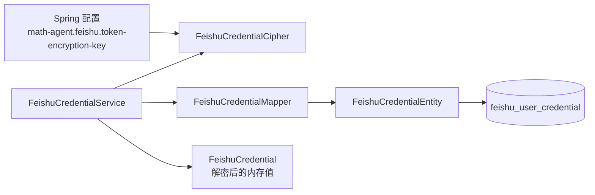
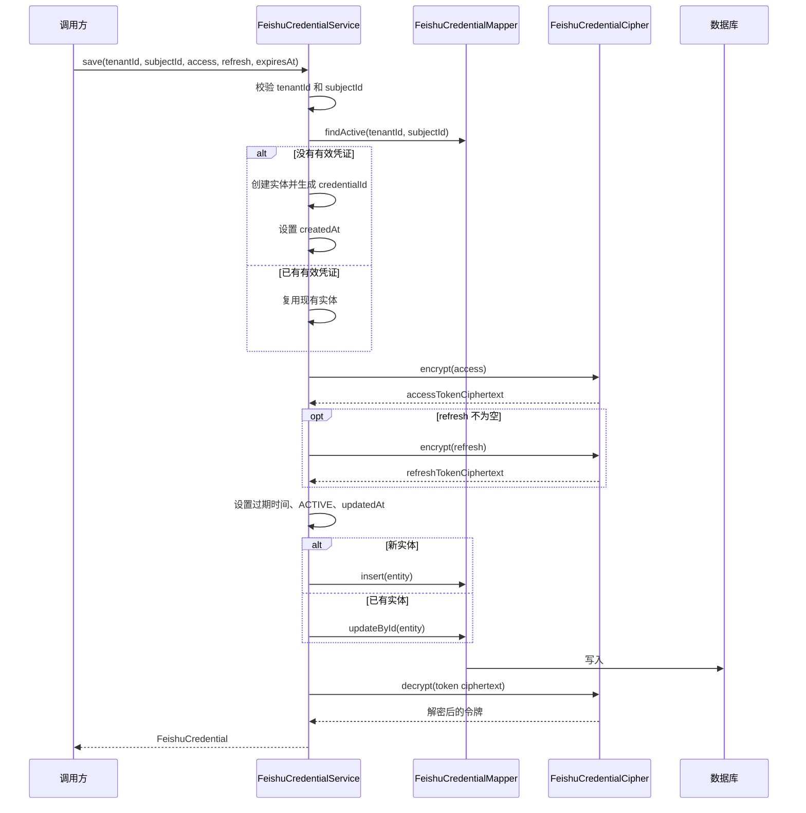

> 凭证实体、密码学封装、服务和 Mapper 共同管理飞书访问凭证的加密存储与读取。

# 飞书凭证加密与持久化

飞书凭证模块负责将租户与用户关联的访问凭证安全地保存到数据库，并在后端同步调用期间按需解密。模块由凭证值对象、数据库实体、AES-GCM 密码学封装、服务层、MyBatis Mapper 和 Spring 配置组成。

## 模块职责

- `FeishuCredential`：表示解密后的凭证，仅作为后端同步调用期间的内存值对象使用。包含凭证 ID、租户 ID、主体 ID、访问令牌、刷新令牌和过期时间。
- `FeishuCredentialEntity`：对应数据库表 `feishu_user_credential`，持久化租户、用户、密文令牌、过期时间、状态和审计时间。
- `FeishuCredentialCipher`：负责访问令牌和刷新令牌的加密与解密。
- `FeishuCredentialService`：统一管理凭证的租户/用户查找、加密保存、解密读取、状态更新和过期标记。
- `FeishuCredentialMapper`：基于 MyBatis-Plus 提供实体 CRUD，并封装按租户、主体或凭证 ID 查询有效凭证的 SQL。
- `FeishuCredentialConfiguration`：从 Spring 配置 `math-agent.feishu.token-encryption-key` 创建密码学组件。

## 组件关系



`FeishuCredentialService` 是核心边界：写入时先通过 `FeishuCredentialCipher` 加密令牌，再交给 Mapper 持久化；读取时从 Mapper 获取有效实体，再解密为 `FeishuCredential`。数据库实体中的令牌字段始终以密文形式表示。

## 加密封装

`FeishuCredentialCipher` 使用 AES-GCM：

- 密钥必须是 Base64 编码，并且解码后严格为 32 字节，即 256 位 AES 密钥。
- 每次加密都会使用 `SecureRandom` 生成 12 字节随机 nonce。
- 加密结果由 `nonce + ciphertext` 拼接后再进行 Base64 编码。
- GCM 使用 128 位认证标签，能够在解密时校验密文完整性。
- 明文令牌不会进入日志或消息。
- 输入令牌为空或仅包含空白字符时，加密操作失败。
- 密钥格式错误、密钥长度不正确或密文无效时，会抛出 `IllegalArgumentException`。
- 底层密码学异常在加密过程中转换为 `IllegalStateException`。

密钥由平台配置提供，而不是由业务调用方传入。配置 Bean 使用 `math-agent.feishu.token-encryption-key` 作为唯一配置来源，并在应用启动时创建密码学组件。因此，配置缺失、格式错误或长度错误会阻止凭证密码学组件正常初始化或使用。

## 持久化模型

数据库表为 `feishu_user_credential`，实体包含以下关键字段：

| 字段 | 作用 |
| --- | --- |
| `id` | 数据库主键 |
| `credentialId` | 对外使用的凭证标识，由服务层生成 UUID |
| `tenantId` | 租户范围 |
| `subjectId` | 用户或主体范围 |
| `accessTokenCiphertext` | 加密后的访问令牌 |
| `refreshTokenCiphertext` | 加密后的刷新令牌，可为空 |
| `expiresAt` | 令牌过期时间 |
| `status` | 凭证状态，保存或更新时设为 `ACTIVE` |
| `createdAt` | 创建时间 |
| `updatedAt` | 最后更新时间 |

`FeishuCredential` 与 `FeishuCredentialEntity` 的边界明确：实体保存密文，值对象承载解密后的令牌。服务层的 `read` 方法负责完成实体到值对象的转换，并将数据库中的 UTC `LocalDateTime` 转换为 `Instant`。

## 保存调用链



保存过程具有以下行为：

1. `tenantId` 和 `subjectId` 不能为空，否则直接抛出 `IllegalArgumentException`。
2. 服务先查询该租户和主体的有效凭证。
3. 没有有效记录时创建新实体并生成 UUID；已有记录时更新该记录。
4. 访问令牌必须加密保存；刷新令牌为空时数据库字段保持为空。
5. `expiresAt` 以 UTC 转换为 `LocalDateTime` 后保存。
6. 保存或更新后状态设为 `ACTIVE`，并刷新 `updatedAt`。
7. 持久化完成后，服务读取并解密实体，返回 `FeishuCredential`。

返回值包含明文访问令牌和刷新令牌，因此调用方必须将其视为敏感的短生命周期数据。源码注释明确表示，解密后的凭证仅应存在于后端同步调用期间。

## 读取调用链

服务提供两种有效凭证读取方式：

- `findActive(tenantId, subjectId)`：按租户和主体查找有效凭证。
- `findActiveById(tenantId, credentialId)`：按租户和凭证 ID 查找有效凭证。

两者都只接受 Mapper 返回的 `ACTIVE` 记录，并通过 `read` 解密令牌。没有匹配记录时返回 `null`，不会创建新凭证。

Mapper 的查询边界同时包含租户条件和 `status = 'ACTIVE'`：

- 按主体查询时，按 `updated_at DESC` 排序并取最新一条。
- 按凭证 ID 查询时，要求 `credential_id` 与 `tenant_id` 同时匹配。
- 通过租户条件避免仅凭凭证 ID 跨租户读取。

因此，调用方不能绕过服务层直接将数据库实体当作可用凭证；可用令牌的读取必须经过有效状态过滤和解密过程。

## 关键状态与过期处理

实体状态当前至少体现两种状态：

- `ACTIVE`：保存和更新凭证时设置。
- `EXPIRED`：`markExpired(tenantId, subjectId)` 找到有效凭证后设置，并更新 `updatedAt`。

`markExpired` 只处理当前有效记录；找不到记录时不执行任何写入。

凭证值对象的 `expired(Instant now)` 使用约 30 秒安全窗口判断是否过期：

```java
expiresAt == null || !expiresAt.isAfter(now.plusSeconds(30))
```

这意味着：

- `expiresAt == null` 会被视为已过期。
- 令牌在当前时间加 30 秒时刻之前或恰好到达该时刻，会被视为已过期。
- `expired` 只进行判断，不会自动更新数据库状态。
- 数据库中的 `ACTIVE` 状态与运行时过期判断是两个不同层次：前者是持久化筛选条件，后者是使用凭证前的时间有效性判断。

## 边界条件

- 加密密钥必须是有效 Base64，且解码结果严格为 32 字节。
- 访问令牌不能为空；刷新令牌可以为空。
- 租户 ID 和主体 ID 必须存在且不能只包含空白字符。
- 读取不存在的有效凭证时返回 `null`。
- 密文为空、格式不正确、认证标签校验失败或密钥不匹配时，解密失败并抛出统一的无效凭证异常。
- 过期时间为空时，运行时 `expired` 判断结果为已过期，但保存逻辑仍允许将空过期时间写入数据库。
- 服务按 UTC 处理 `Instant` 与数据库 `LocalDateTime` 的转换，避免依赖服务器本地时区。

## 扩展点

- **密钥管理**：当前密码学封装依赖单一平台配置密钥。若引入密钥轮换，需要增加密钥版本或密钥标识，并支持按版本解密及迁移重加密。
- **状态模型**：当前状态通过字符串 `ACTIVE` 和 `EXPIRED` 表示。若需要区分撤销、刷新失败或待授权等情况，可扩展状态枚举和对应的 Mapper 查询条件。
- **刷新策略**：服务目前负责保存和读取刷新令牌，但源码证据中未显示自动刷新流程。令牌刷新逻辑可在服务层或其上层授权流程中复用 `save` 更新密文和过期时间。
- **并发保存**：当前保存流程是“查询有效记录后插入或更新”。如果同一租户和主体可能并发完成授权，需要由数据库唯一约束、事务或幂等策略进一步约束重复记录。
- **凭证缓存**：当前读取路径直接经过 Mapper 和解密。若增加缓存，应避免缓存明文凭证，并保持租户范围、状态和过期窗口的校验。

## 主要文件

- [FeishuCredential.java](backend-java/src/main/java/com/doob/mathagent/feishu/FeishuCredential.java#L1-L10)
- [FeishuCredentialCipher.java](backend-java/src/main/java/com/doob/mathagent/feishu/FeishuCredentialCipher.java#L1-L65)
- [FeishuCredentialEntity.java](backend-java/src/main/java/com/doob/mathagent/feishu/FeishuCredentialEntity.java#L1-L31)
- [FeishuCredentialService.java](backend-java/src/main/java/com/doob/mathagent/feishu/FeishuCredentialService.java#L1-L31)
- [FeishuCredentialMapper.java](backend-java/src/main/java/com/doob/mathagent/feishu/FeishuCredentialMapper.java#L1-L14)
- [FeishuCredentialConfiguration.java](backend-java/src/main/java/com/doob/mathagent/feishu/FeishuCredentialConfiguration.java#L1-L21)

Sources: [FeishuCredential.java](backend-java/src/main/java/com/doob/mathagent/feishu/FeishuCredential.java#L1-L10), [FeishuCredentialCipher.java](backend-java/src/main/java/com/doob/mathagent/feishu/FeishuCredentialCipher.java#L1-L65), [FeishuCredentialEntity.java](backend-java/src/main/java/com/doob/mathagent/feishu/FeishuCredentialEntity.java#L1-L31), [FeishuCredentialService.java](backend-java/src/main/java/com/doob/mathagent/feishu/FeishuCredentialService.java#L1-L31), [FeishuCredentialMapper.java](backend-java/src/main/java/com/doob/mathagent/feishu/FeishuCredentialMapper.java#L1-L14), [FeishuCredentialConfiguration.java](backend-java/src/main/java/com/doob/mathagent/feishu/FeishuCredentialConfiguration.java#L1-L21)
