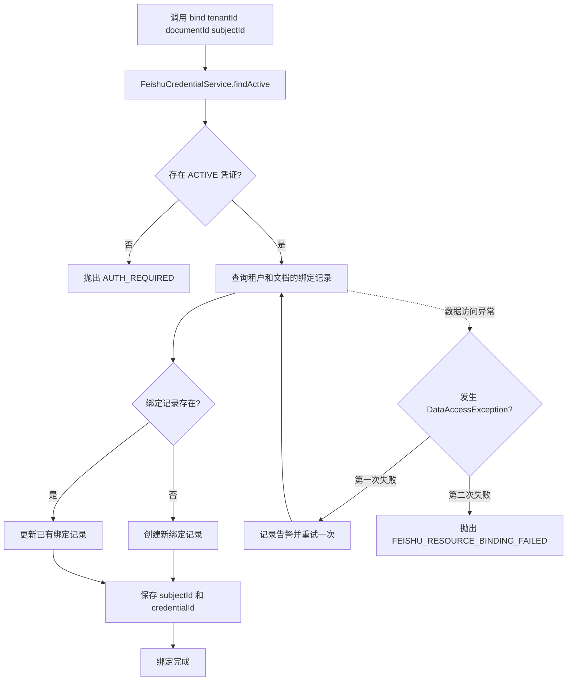

> 资源绑定实体、服务和 Mapper 维护飞书资源与系统对象之间的关联。

# 飞书资源绑定

飞书资源绑定模块负责维护飞书资源与系统授权主体之间的持久化关联。它以租户和文档为资源定位范围，将资源绑定到能够访问该资源的用户主体及其 OAuth 凭证，但不在绑定记录中保存访问令牌。

## 模块职责

模块由实体、服务和 Mapper 三层组成：

- `FeishuResourceBindingEntity`：表示一条资源绑定记录，对应数据库表 `feishu_resource_binding`。
- `FeishuResourceBindingService`：负责校验授权、创建或更新绑定，并提供资源到用户主体的解析能力。
- `FeishuResourceBindingMapper`：按租户和文档查询绑定记录，并继承 MyBatis-Plus 的基础增删改能力。
- `FeishuCredentialService`：作为前置授权依赖，确认指定租户下指定主体存在有效凭证，并向绑定服务提供 `credentialId`。

绑定记录的核心字段包括：

| 字段 | 含义 |
| --- | --- |
| `tenantId` | 资源所属租户，用于隔离不同租户的数据 |
| `documentId` | 飞书文档或资源标识 |
| `subjectId` | 系统中的授权主体标识，通常对应完成 OAuth 授权的用户主体 |
| `credentialId` | 关联的飞书凭证标识 |
| `createdAt` | 绑定创建时间 |
| `updatedAt` | 绑定更新时间 |

实体通过 `@TableName("feishu_resource_binding")` 映射到绑定表，主键为 `id`。绑定实体只保存凭证标识，不承载访问令牌或刷新令牌。

## 调用链

资源绑定的入口是 `FeishuResourceBindingService.bind`：

关键节点如下：

1. 服务先调用 `FeishuCredentialService.findActive(tenantId, subjectId)` 查找有效凭证。
2. 找不到有效凭证时立即抛出 `AUTH_REQUIRED`，不会创建没有授权依据的绑定。
3. 通过 Mapper 按 `tenantId + documentId` 查询已有绑定。
4. 没有记录时创建新实体；已有记录时复用该资源绑定并更新关联信息。
5. 绑定过程最多执行两次。数据库访问异常会记录租户、文档和尝试次数；第二次仍失败时抛出 `FEISHU_RESOURCE_BINDING_FAILED`。
6. 成功保存后，调用方可以通过 `subjectId(tenantId, documentId)` 查询资源当前绑定的主体。

## 关键状态

### 凭证状态

资源绑定依赖凭证服务返回的有效凭证。凭证服务在保存凭证时将状态设置为 `ACTIVE`，过期处理则会将凭证状态标记为 `EXPIRED`。因此，资源绑定本身不负责令牌刷新或过期转换，而是通过 `findActive` 将无效凭证挡在绑定入口之前。

凭证服务还负责访问令牌和刷新令牌的加密、解密及持久化；资源绑定服务只接收凭证对象并使用其 `credentialId` 建立关联。

### 绑定状态

从当前源码可确认的绑定状态主要是：

- **未绑定**：`mapper.find(tenantId, documentId)` 返回 `null`，资源尚未建立绑定。
- **已绑定**：存在绑定实体，可通过 `subjectId` 查询授权主体。
- **待绑定但未授权**：主体没有有效飞书凭证，绑定请求以 `AUTH_REQUIRED` 失败。
- **持久化失败**：数据库访问异常经一次重试后仍失败，以 `FEISHU_RESOURCE_BINDING_FAILED` 结束。

绑定查询以租户和文档为边界，不提供跨租户资源解析。`subjectId` 查询只返回绑定记录中的主体标识，不返回令牌材料。

## 主要文件

- [FeishuResourceBindingEntity.java](backend-java/src/main/java/com/doob/mathagent/feishu/FeishuResourceBindingEntity.java#L1-L9)：绑定实体及数据库表映射。
- [FeishuResourceBindingService.java](backend-java/src/main/java/com/doob/mathagent/feishu/FeishuResourceBindingService.java#L1-L25)：授权前置校验、绑定写入、异常重试和主体解析。
- [FeishuResourceBindingMapper.java](backend-java/src/main/java/com/doob/mathagent/feishu/FeishuResourceBindingMapper.java#L1-L6)：按租户和文档查询绑定，并提供基础持久化操作。
- [FeishuCredentialService.java](backend-java/src/main/java/com/doob/mathagent/feishu/FeishuCredentialService.java#L9-L29)：提供有效凭证查询，并维护凭证加密和生命周期状态。

## 边界条件

- `tenantId`、`documentId` 和 `subjectId` 是绑定调用的关键边界参数；当前源码明确展示了凭证服务对租户和主体的非空校验。
- 没有有效凭证时不会降级为仅保存资源关系，调用直接失败并返回 `AUTH_REQUIRED`。
- 数据库异常只进行一次重试，总尝试次数为两次，避免将持久化问题无限隐藏。
- 绑定查询严格限定 `tenant_id` 和 `document_id`，并通过 `LIMIT 1` 返回一条记录。
- 服务日志记录租户标识和文档标识，但不记录访问令牌；异常处理也不会将凭证明文作为业务返回。
- 资源绑定与 OAuth 凭证生命周期分离：凭证过期由凭证服务处理，绑定记录不会因此自动删除。后续读取或重新绑定时仍需经过有效凭证检查。

## 扩展点

- **资源类型扩展**：当前实体使用 `documentId` 表示飞书资源。若未来需要支持文件夹、表格或其他资源类型，可增加资源类型字段，或抽象统一的外部资源标识。
- **授权主体扩展**：当前绑定以 `subjectId` 表示主体。若需要支持团队、角色或服务账号，可在主体类型和主体标识层面扩展。
- **权限粒度扩展**：现有绑定表达“某主体可关联该资源”的关系。若需要区分只读、编辑或分享权限，可在绑定实体中增加权限范围和有效期。
- **一致性约束**：绑定查询和写入逻辑以租户、文档为资源定位键。若业务要求同一租户下一个文档只能存在一条有效绑定，应在数据库层补充相应唯一性约束，并配合并发写入处理。
- **凭证失效联动**：当前绑定服务依赖凭证查询结果。后续可以在凭证过期、撤销或重新授权时增加绑定清理、重新归属或异步校验机制。
- **可观测性增强**：现有实现已对持久化失败记录告警。可进一步补充绑定成功、未授权失败和凭证失效的指标，用于区分授权问题与数据库问题。

Sources: [FeishuResourceBindingEntity.java](backend-java/src/main/java/com/doob/mathagent/feishu/FeishuResourceBindingEntity.java#L1-L9), [FeishuResourceBindingService.java](backend-java/src/main/java/com/doob/mathagent/feishu/FeishuResourceBindingService.java#L1-L25), [FeishuResourceBindingMapper.java](backend-java/src/main/java/com/doob/mathagent/feishu/FeishuResourceBindingMapper.java#L1-L6), [FeishuCredentialService.java](backend-java/src/main/java/com/doob/mathagent/feishu/FeishuCredentialService.java#L9-L29)
