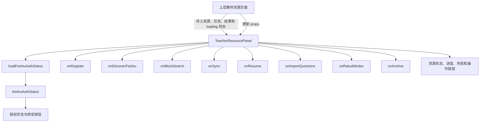
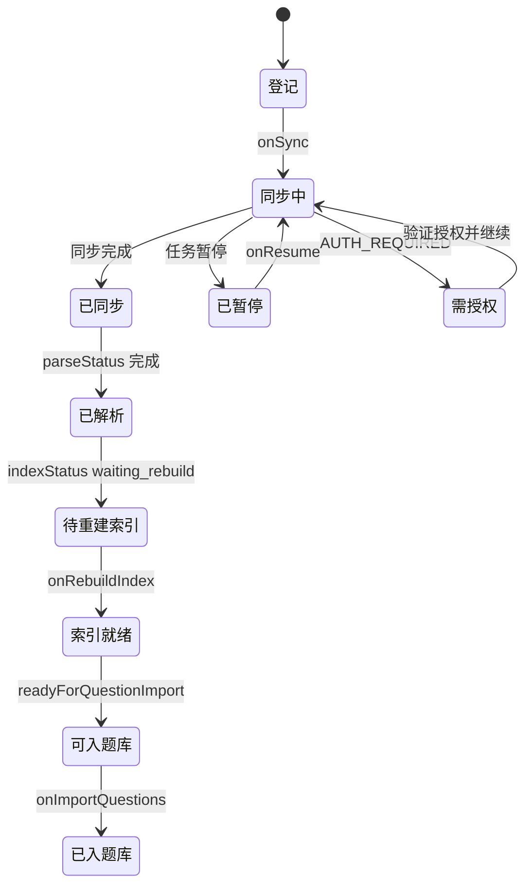

> TeacherResourcePanel 提供教师侧资源浏览、同步和可见性相关交互。

# 教师资源面板

`TeacherResourcePanel` 是教师侧资源管理的前端面板，负责承载资源登记、飞书资源发现、资源检索、同步进度查看、失败恢复、题目入库和索引重建等交互。组件本身不直接调用后端 API，而是接收资源数据、运行状态和回调函数，由上层页面负责数据加载、命令提交及结果刷新。

## 模块职责

面板主要承担以下职责：

- 展示已登记的教师资源及其来源、权限范围和处理状态。
- 根据来源类型切换飞书链接输入或本地文件、文件夹上传输入。
- 检查飞书授权状态，并在需要时跳转授权页面。
- 浏览或搜索可用的飞书节点，并将选中的候选资源回填到登记流程。
- 对已登记资源执行同步、暂停任务恢复、题目入库和向量索引重建。
- 展示同步任务、下载断点、失败信息和本地预览文件。
- 检索资源块，并展示命中片段、权限范围、来源位置和受控图片或附件。
- 根据同步、解析和索引状态限制后续题目入库操作。

组件通过 `PanelTitle`、`StatusLine`、`compactText` 等共享展示工具组织页面结构和状态反馈。

## 组件边界

组件的输入可以分为四类：

1. **资源与结果数据**
   - `resources`
   - `syncJobsByDocument`
   - `syncCheckpointsByJob`
   - `blockSearchResult`
   - `blockSearchAudit`
   - `feishuDiscoveryResult`
   - `importResult`
   - `indexRebuildResult`

2. **表单值**
   - `location`
   - `files`
   - `sourceType`
   - `scope`
   - `feishuExportFormat`
   - `parseMode`
   - `blockSearchQuery`
   - `feishuDiscoveryQuery`

3. **运行状态**
   - `loading`
   - `registering`
   - `searchingBlocks`
   - `discoveringFeishu`
   - `syncingResourceId`
   - `importingResourceId`
   - `rebuildingResourceId`
   - `deletingResourceId`
   - `error`

4. **动作回调**
   - 表单值变更回调
   - 飞书发现与候选选择回调
   - 资源登记、同步、恢复、归档回调
   - 题目入库和索引重建回调
   - 飞书授权状态及授权地址加载函数

这种设计使面板保持为“受控展示组件”：状态和业务操作由外部协调，组件只维护飞书授权检查这一项局部 UI 状态。

## 调用链

关键节点如下：

- `TeacherResourcePanel` 负责收集用户操作并调用回调。
- 上层页面负责实际的数据请求和状态更新。
- 飞书授权检查由面板在挂载及依赖变化时触发。
- 同步任务和断点通过 `syncJobsByDocument`、`syncCheckpointsByJob` 按资源和任务 ID 关联展示。
- 资源状态更新后，组件通过新的 props 重新渲染，而不是自行维护资源列表。

## 飞书授权状态

面板区分三种业务授权状态和一种临时状态：

| 状态 | 页面含义 |
| --- | --- |
| `AUTHORIZED` | 个人账号已绑定 |
| `BOT_AUTHORIZED` | 机器人已配置，可同步共享资料 |
| `AUTH_REQUIRED` | 需要授权 |
| `LOADING` | 正在检查授权状态 |

`BOT_AUTHORIZED` 不会被显示为个人账号授权。该区分避免界面错误地暗示教师可以访问个人飞书空间。

组件初始状态为 `LOADING`，随后调用 `loadFeishuAuthStatus()`：

- 请求成功时写入后端返回的状态。
- 请求失败时降级为 `AUTH_REQUIRED`。
- 使用 `active` 标记避免组件卸载后继续更新状态。
- 点击授权按钮时调用 `loadFeishuAuthorizationUrl()`，成功后通过 `window.location.assign` 跳转；失败则回到 `AUTH_REQUIRED`。

当来源类型为飞书时，登记按钮要求授权状态为 `AUTHORIZED` 才可提交。机器人授权只允许显示为已配置共享资料的状态，不会解除个人账号登记限制。

## 资源登记

登记表单根据 `sourceType` 选择输入方式：

- `feishu`
  - 输入飞书链接。
  - 选择导出格式：Markdown、DOCX 或 PDF。
  - 显示飞书授权状态。
- 非飞书来源
  - 可选择多个文件。
  - 支持目录上传，通过 `webkitdirectory` 和 `directory` 属性读取文件夹。
  - 可选填写服务器本地路径。

支持的来源类型包括：

- 飞书链接
- 教师资料上传
- QQ 专题包上传
- 高考真题上传
- 模拟题上传
- 服务器本地路径

登记时还可以指定：

- 资源范围：教师共享、租户公开、教师私有、班级授权、教研共享或公开教材。
- 解析模式：
  - `TEXT`：文字与结构提取。
  - `MARKDOWN_ASSETS`：以 Markdown 形式处理并下载图片到本地。
  - `AI`：进行图文语义标注。

本地文件列表最多展示前 6 个文件，超出部分只显示省略数量。文件展示使用相对路径或文件名、MIME 类型和文件大小，避免大量文件撑大面板。

## 飞书资源发现

飞书发现区域提供两种操作：

- **列出**：按目录浏览候选节点。
- **搜索**：按关键词查找候选节点。

结果中展示：

- 查询模式。
- 候选数量。
- 候选名称。
- 资源类型。
- 路径。
- 是否可下载。

只有 `downloadable` 的候选项可以点击“选用”。选中后通过 `onUseFeishuCandidate` 交给上层处理，组件本身不直接修改登记地址。

## 资源检索

资源检索表单通过 `onBlockSearch` 提交查询，结果由 `blockSearchResult` 驱动展示。

每条命中结果包含：

- 文档标题。
- 权限范围。
- 来源类型。
- 资源块类型。
- 页码。
- 块角色。
- 截断后的摘要。
- 原始来源路径。
- 受控图片或附件数量。
- 对应的 `assetId` 数量。

资源附件通过受控 `assetUri` 打开，并使用新窗口和 `noreferrer`。命中片段默认收起在“查看片段”详情区域中；当 `evidenceText` 与摘要不同时，会额外展示完整证据文本。

检索结果顶部还展示检索模式、命中数和审计耗时。审计信息是可选的，缺失时不显示耗时。

## 资源状态与操作

每个资源项根据 `documentId` 展示以下信息：

- 来源类型。
- 权限范围。
- 飞书导出格式。
- 解析模式。
- 同步状态。
- 飞书错误码。
- 解析状态。
- 向量状态。
- 索引状态。

资源优先使用该文档最新同步任务的状态；没有同步任务时回退到资源自身的 `syncStatus`。同步任务通过资源 ID 取出，并以列表首项作为最新任务。对应断点则通过最新任务的 `jobId` 从 `syncCheckpointsByJob` 获取。

资源还可能显示：

- 最新同步任务消息或创建时间。
- 本地预览文件名。
- 预览文件目录树。
- 同步失败详情。
- 下载断点详情。

可执行操作包括：

- **同步**：调用 `onSync(documentId)`。
- **恢复**：当最新任务状态为 `paused` 时调用 `onResume`。
- **验证授权并继续**：当最新任务状态为 `AUTH_REQUIRED` 时调用 `onResume`。
- **入题库**：资源完成必要处理后调用 `onImportQuestions(documentId)`。
- **重建索引**：调用 `onRebuildIndex(documentId)`。
- **归档**：通过 `onArchive(documentId)` 交由上层处理。

同一资源正在同步时，同步和恢复按钮会被禁用并显示加载图标。题目入库按钮在资源尚未达到就绪条件时禁用，并显示“资料需完成同步、解析和索引后才能入题库”的原因提示。

资源就绪条件由 `isTeacherResourceReady(resource)` 统一判断。测试证据表明：即使同步和解析已经完成，只要索引仍为 `waiting_rebuild`，资源仍不可入题库，且索引状态会持续显示为“待重建”。

## 同步与权限边界

同步任务属于资源的运行历史，包含下载阶段、失败原因和恢复断点等操作性信息。`canLoadTeacherResourceSyncJobs` 对教师侧同步任务读取进行了主体限制：

- 管理员可以读取。
- 普通用户必须拥有与资源 `ownerSubjectId` 相同的 `userId`。
- 资源即使对租户可见，也不代表其他教师可以读取该资源的同步历史。

因此，资源可见性和同步历史可见性是两个不同边界：

- 资源本身可以按权限范围参与浏览或检索。
- 同步任务及断点属于资源所有者或管理员的操作信息。

## 关键状态转换

图中的状态来自面板对同步任务、解析状态和索引状态的组合展示。题目入库并不是只依赖同步成功，而是依赖同步、解析和索引均达到就绪条件。

## 边界条件

- 飞书授权检查失败时，界面显示“需要授权”，不会将失败误报为已授权。
- 组件卸载后不会继续写入飞书授权状态。
- 飞书来源在未获得个人授权时不能登记。
- 飞书发现结果为空时只显示结果容器，不产生候选操作。
- 不可下载的飞书候选项不能被选用。
- 没有已登记资源时显示空状态。
- 没有同步任务时，资源自己的同步状态作为展示回退。
- 同步任务没有失败对象时不显示失败详情。
- 没有断点时不显示断点信息。
- 没有预览文件时不显示文件树。
- 资源没有附件时不显示附件列表。
- 查询命中中的页码、块角色、来源路径和证据文本均为可选字段。
- 文件上传列表只展示最多 6 项，其余文件以数量概括。
- 正在提交登记、检索、发现或资源操作时，相关按钮禁用并显示加载状态。

## 主要文件

- [`frontend/src/app/components/TeacherResourcePanel.tsx`](frontend/src/app/components/TeacherResourcePanel.tsx)：页面主体、表单、资源列表、检索结果、同步状态和操作按钮。
- [`frontend/src/app/teacherResourceSyncVisibility.ts`](frontend/src/app/teacherResourceSyncVisibility.ts)：教师同步任务读取权限判断。
- [`frontend/src/app/TeacherResourcePanel.test.tsx`](frontend/src/app/TeacherResourcePanel.test.tsx)：面板渲染、索引就绪门禁、Markdown 解析模式和飞书授权文案测试。
- [`frontend/src/shared/api/textbookApi.ts`](frontend/src/shared/api/textbookApi.ts)：面板使用的资源、同步、检索、导入和索引结果类型定义，具体 API 调用由上层回调实现。

## 扩展点

1. **新增资源来源**
   - 扩展来源类型选择项。
   - 增加对应输入控件或文件处理规则。
   - 保持登记回调的统一入口，避免在面板内引入来源专属 API 调用。

2. **新增资源处理阶段**
   - 在资源状态区域增加新的状态字段和文案映射。
   - 将新阶段纳入 `isTeacherResourceReady` 的就绪判断。
   - 同步补充按钮禁用条件和测试。

3. **增强同步恢复**
   - 扩展同步任务状态分支。
   - 继续通过 `onResume(documentId, jobId)` 交由上层协调授权、重试或断点恢复。

4. **扩展可见性模型**
   - 在资源范围选择项和显示标签中增加新范围。
   - 同时检查同步历史读取策略，避免资源可见性扩大时意外暴露所有者级运行信息。

5. **增加检索过滤**
   - 可在检索表单中增加来源、权限范围、资源类型或解析模式过滤。
   - 过滤值应通过受控 props 和回调传递，以保持组件与请求层解耦。

6. **增强可观测性**
   - 可继续利用 `blockSearchAudit` 展示检索耗时、缓存命中或审计标识。
   - 同步错误应继续从结构化 failure 字段读取，避免只依赖自由文本消息。

Sources: [frontend/src/app/components/TeacherResourcePanel.tsx](frontend/src/app/components/TeacherResourcePanel.tsx#L1-L420), [frontend/src/app/components/TeacherResourcePanel.tsx](frontend/src/app/components/TeacherResourcePanel.tsx#L344-L746), [frontend/src/app/teacherResourceSyncVisibility.ts](frontend/src/app/teacherResourceSyncVisibility.ts#L1-L14), [frontend/src/app/TeacherResourcePanel.test.tsx](frontend/src/app/TeacherResourcePanel.test.tsx#L1-L106)
